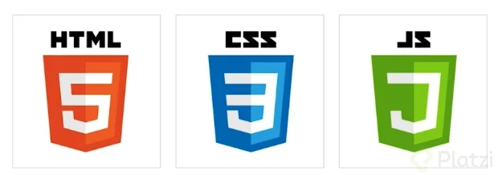
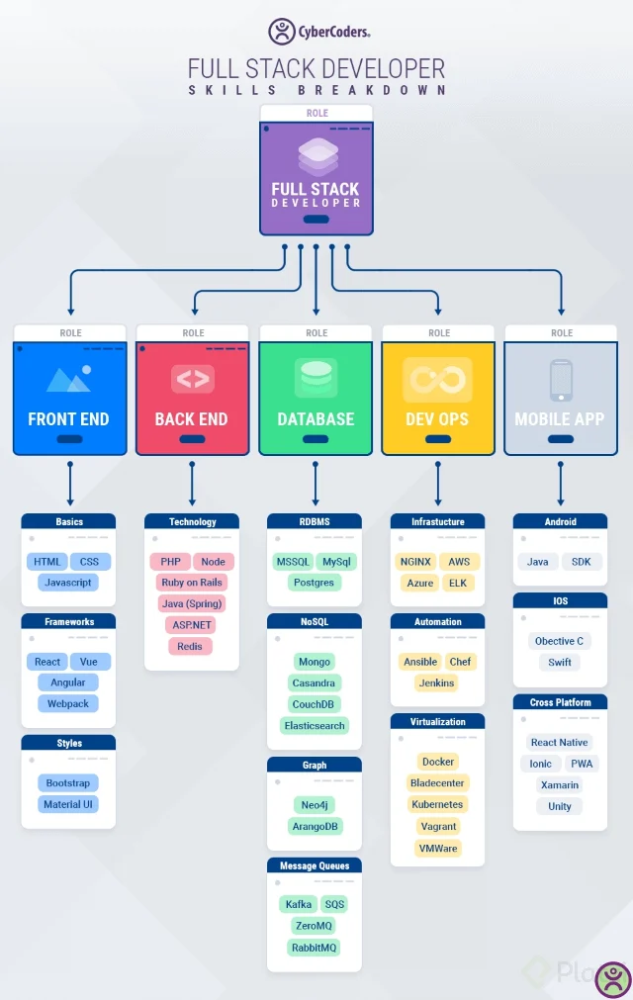
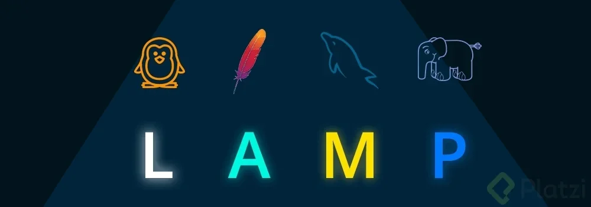
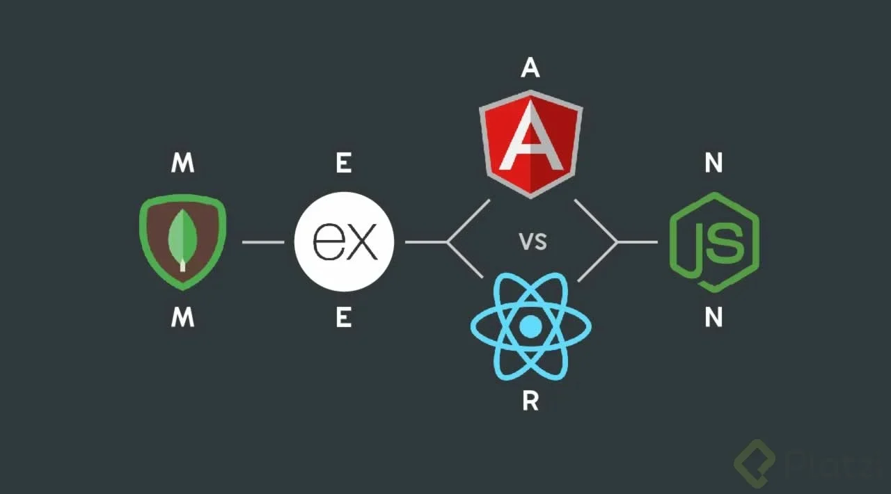

# ¿Qué es Full Stack?

**Full Stack** es un término utilizado para describir a los desarrolladores que conocen **tanto los lenguajes de frontend como de backend**. Principalmente, el **desarrollo full stack** se refiere al uso de JavaScript en el backend y de HTML/CSS/JavaScript en el frontend para crear nuevas plataformas.

El nacimiento de tecnologías que funcionan entre el frontend y el backend ha dado lugar a la proliferación de frameworks y herramientas de desarrollo full stack, que permiten a los desarrolladores construir sus propias aplicaciones web completas empleando un único lenguaje de programación, como Django para Python.

## Qué es un desarrollador Full Stack

Las y los **desarrolladores Full Stack** son profesionales que se encargan tanto de la parte visual y de interacción de un sitio (frontend), como de su lógica y funcionamiento del lado del servidor (backend).

Un *stack* (en inglés: pila o montón) se refiere al grupo de tecnologías que componen un sitio web en todos los aspectos (desde la base de datos, hacia el manejo lógico y la interfaz visual). Una o un **desarrollador Full Stack** en teoría es capaz de manejar la pila completa de un sitio, tanto de frontend como de backend, además sabe utilizar su base de datos.

## Qué hace un desarrollador Full Stack

Una desarrolladora o **desarrollador Full Stack** entiende muy bien cómo funciona un producto web de principio a fin, desde su diseño en mockup y deploy hasta producción.

Este tipo de programador o programadora no maneja por completo todas las tecnologías de ambas partes, pues cada una requiere conocimiento profundo. De hecho, no es recomendado profundizar en tantas especialidades y no es sano. El desarrollo web evoluciona muy rápido y cada dos o tres meses encontrarás algo nuevo.

## Cómo ser un desarrollador Full Stack

Para convertirse en Full Stack developer debes dominar las dos áreas básicas: [backend y frontend](https://platzi.com/blog/que-es-frontend-y-backend/). Esto te ayudará a comprender cómo funciona cada uno y a generar una comunicación entre sí. La mayoría de la interacción entre estos dos mundos se basa en consumo de API y comprender cómo consumir una API desde el Frontend te ayudará a entender a cómo construir una API desde el Backend.

Además, aprender de las diferentes formas que tenemos de subir en internet una aplicación web te ayudará a entender las diferentes estrategias de *deploy* que existen y te permitirá ampliar tus conocimientos en el mundo del desarrollo web.

## Tecnologías Full Stack para desarrolladores

Aprender un *stack* conocido puede ayudarte a dar tus primeros pasos como desarrollador Full Stack y a escalar un proyecto a producción de una manera más rápida y con una mayor interacción. Para eso necesitas estas herramientas.

- LAMP (Linux, Apache, MySQL, PHP)

- MERN (MongoDB, Express.js, React, Node)

- PERN (PostgreSQL, Express.js, React, Node)

## MIS NOTAS

(nota mía) Un FullStack es el desarrollador que entiende bien como funciona un producto web de principio a fin (desde Mock-ups a liberar aplicación a producción) IMPORTANTE Frase. Luego puedes decir en qué área te vas a especializar. Dónde más puedes agregar valor.

El beneficio para el proyecto de alguien fullstack es que entiende muy bien cómo funciona un producto web de principio a fin, desde su diseño en mockup y deploy hasta producción.
Desventajas de ser desarrollador Fullstack

Un fullstack no maneja por completo todas las tecnologías de ambas partes, pues cada una requiere conocimiento profundo. De hecho, no es recomendado y no es sano. El desarrollo web evoluciona muy rápido y cada dos o tres meses tenemos algo nuevo, tanto en backend como en frontend.
