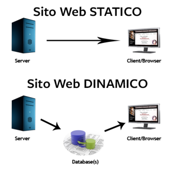

# Páginas Estáticas vs. Dinámicas

Los sitios web se comportan de forma diferente dependiendo de la forma en que fueron diseñados desde su concepción, tomando en cuenta la interacción con el usuario. Aquí veremos las diferencias entre sitios web estáticos y dinámicos:

## Sitios Web Estáticos

La información que contiene se mantiene constante y estática. No se actualiza con la interacción del usuario. Es conveniente para realizar landing pages (páginas informativas o de aterrizaje) o blogs. Se mostrarán siempre iguales para todos los usuarios.

## Sitios Web Dinámicos

También conocidos como aplicaciones web, actualizan su información con respecto a la interacción del usuario. Dependen de una base de datos, de donde extrae e ingresa información. Serán diferentes, dependiendo del usuario que la use y la información que se ingrese.

Ejemplo de páginas estáticas:

- Menú de un restaurante
- Blog de viajes
- Página informativa de un negocio

Ejemplo páginas dinámicas:

- Sistema de reporte de ventas
- Linkedin
- Banca en línea

## MIS NOTAS

Páginas estáticas: todos los productos Web que tienen una información para consumir y que esa información no va a cambiar. (páginas informativas o landing pages).

Páginas dinámicas: 

**Sitios Web Estáticos:** 
- La información que contiene, se mantiene constante y estática. 
- No se actualiza con la interacción del usuario.
- Conveniente para landing pages (Páginas informativas) o Blogs.
- Serán siempre iguales para todos los usuarios.

**Sitios Web Dinámicos (Aplicaciones Web (Web Apps):** 
- Actualizan su información con respecto a la interacción del usuario. 
- Dependen de una base de datos, de donde extrae e ingresa información.
- Serán diferentes, dependiendo del usuario que la use.
