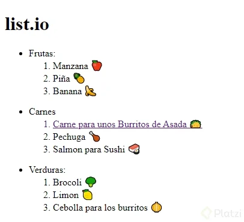

# Reto: crea tu lista de compras del supermercado

En el siguiente ejemplo, veremos la forma de ordenar los elementos de una lista de forma anidada en HTML. Para el ejemplo usamos una lista de frutas y verduras:

```html
<nav>
    <ul>
    <li>Frutas:</li>
    <ol>
        <li>Manzana 🍎</li>
        <li>Piña 🍍</li>
        <li>Banana 🍌</li>
    </ol>
    </ul>
    <ul>
    <li>Carnes:</li>
    <ol>
        <a
        href="https://www.youtube.com/watch?v=qpSYO-QNvIY"
        target="_blanck"
        >
        <li>Carne para unos Burritos de Asada 🌮</li>
        </a>
        <li>Pechuga 🍗</li>
        <li>Salmon para Sushi 🍣</li>
    </ol>
    </ul>
    <ul>
    <li>Verduras:</li>
    <ol>
        <li>Brocoli 🥦</li>
        <li>Limon 🍋</li>
        <li>Cebolla para los burritos 🧅</li>
    </ol>
    </ul>
</nav>
```

El resultado a mostrarse en el navegador sería así:

