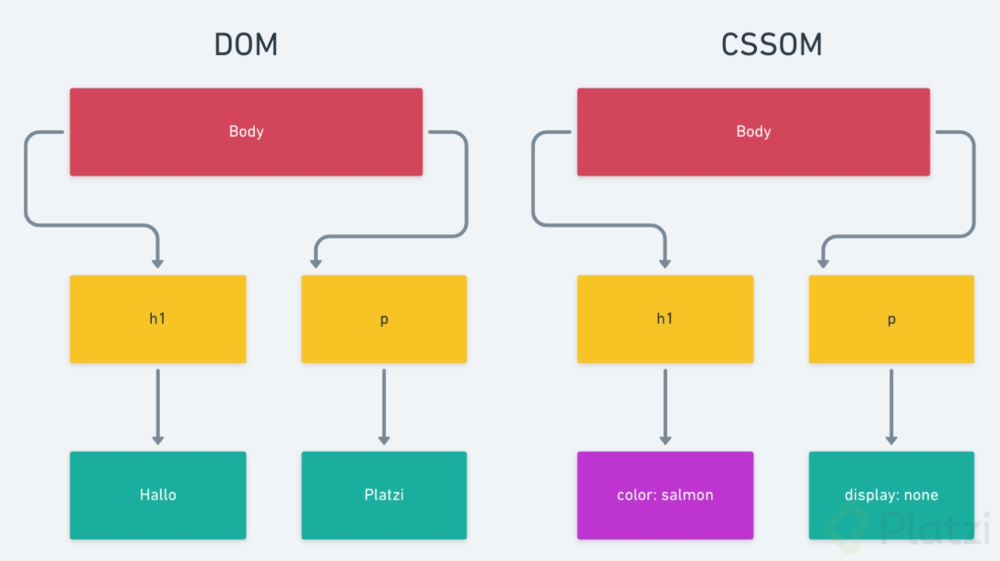

# ¿Qué es el DOM?

<h4>Ideas/conceptos claves</h4>
Critical Rendering Path Es el proceso que se encarga de convertir en pixeles el HTML, CSS y JS

El DOM arbol para el HTML que contiene toda nuestra estructura HTML

El CSSOM es el arbol para el CSS

<h4>Apuntes</h4>
Todos los navegadores los utilizan para trabajar en un sitio web
Todo comienza con el proceso llamado “Critical Rendering Path”
Se puede dividir en 5 partes
A lo largo del proceso el navegador crea dos arboles
DOM
Es una representación del HTML
Estructura en forma de árbol de nodos
Es un modelo que puede ser modificado
CSSOM

RESUMEN: Para mostrar un sitio hay un proceso llamado Critical Render Path en él se crean dos árboles el DOM y el CSSOM. El Dom sera aquel que se encargará de tener todo nuestro contenido en una representación de arbol que contendrá nodos

OTRO:

DOM(Document Object Model): no es mas que un árbol de nodos en el cual esta representado cada una de las etiquetas HTML que nosotros colocamos en nuestro proyecto.

CSSOM(CSS Object Model): es un conjunto de APIs que permite manipular CSS desde JavaScript. Así como el DOM (Document Object Model) es para HTML, el CSSOM (CSS Object Model) es para CSS. Permite leer y modificar el estilo de CSS de forma dinámica.

Para llegar al dom y cssom ocurre un proceso que se llama El Camino Crítico de Renderización(Critical Rendering Path) es la secuencia de pasos que el navegador realiza para convertir el HTML, CSS y JavaScript en píxeles en la pantalla.

### Lecturas recomendadas

- [Can I use ... Support tables for HTML5, CSS3, etc](https://caniuse.com/)

- [Documentación web de MDN](https://developer.mozilla.org/es/)