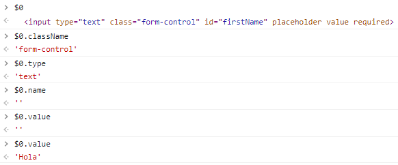

# Atributos y propiedades
Se dan vida a los elementos del DOM.

**Pregunta de entrevista:**
¿Cual es la diferencia entre un atributo y una propiedad?

los atributos son utilizados unicamente al inicio del HTML


las propiedades pueden cambiar

-----

Básicamente un atributo es el estado inicial en nuestro HTML, es HTML solo podemos escribir atributos porque es el estado inicial con el que se renderizan y una propiedad es la variable que podemos cambiar a lo largo de la ejecución del programa mediante JavaScript, es decir, podemos acceder a dichos atributos y cambiarlo, haciendo que sean propiedades, aquí un poco más de información sobre ello.
.
Lo genial de JavaScript es que podemos cambiarlas de forma dinámica. Recordemos que JavaScript son en su mayoría objetos, por lo que los nodos HTML dentro de JavaScript son representados como objetos. Teniendo eso en cuenta, podemos acceder a cualquier atributo de dichos nodos desde HTML y cambiar sis propiedades, por ejemplo:

```
// Al seleccionar el nodo HTML, JavaScript lo convierte en un objeto!
const input = document.querySelector("input")

// Y of course, podemos modificarlo como cualquier otro objeto de JavaScript:
input.placeholder = "Escribe algo"
input.value = 2
input.type = "number"
```

OTRO

Atributos y propiedades
<h4>Ideas/conceptos claves</h4>
Los atributos de HTML son palabras especiales utilizadas dentro de la etiqueta de apertura, para controlar el comportamiento del elemento. Los atributos de HTML son un modificador de un tipo de elemento de HTML

Propiedad del DOM sera inicializada por los atributos del HTML para posteriormente modificarlas

<h4>Recursos</h4>
What is the difference between properties and attributes in HTML? - GeeksforGeeks

<h4>Apuntes</h4>
El 80% del tiempo que estemos manipulando el DOM, lo que haremos sera cambiando dinámicamente con JS las propiedades de un elemento
Podemos acceder y modificar las propiedades mediante las propiedades del elemento deseado

```
// 👀 Lectura
console.log(inputName.value) // "Fer"
// 📝 Modificación
inputName.value = "Fernando"
```

<h4>Atributo 🆚 Propiedad</h4>
Atributo
Definidas por el HTML
Constantes
Solo se usan para iniciar el HTML y las propiedades del DOM
Propiedad
Son lo que irán cambiando en JS
Definidas por el DOM
Valor de una propiedad es variable
RESUMEN: Las propiedades de los elementos serán aquellas que mayormente se modificarán. La diferencia entre un atributo y una propiedad es que el atributo para iniciar el HTML y DOM, son constantes mientras que las propiedades vienen del DOM y se pueden ir cambiando


OTRO

Diferencia entre atributos y propiedades
Fue un poco confuso en la clase, pero creo que puedo aclararlo en 4 puntos:

1. Los atributos nacen cuando creamos un elemento HTML en el código (estado inicial).
2. Este elemento será representado en el DOM como un nodo y por ende su representación será un objeto. Como sabemos, todo objeto puede tener propiedades y los nodos efectivamente las tendrán (y bastantes!).
3. Una de esas propiedades se llama “attributes” y contiene los atributos que habíamos indicado en el HTML.
4. El objeto aparte de la propiedad attributes tendrá más propiedades, algunas de ellas de nombre idéntico o similar a los atributos (id es exactamente igual, pero por ejemplo el atributo “class” se encuentra como propiedad del objeto bajo el nombre “className”).
5. Aparte de la cercanía entre los nombres, algunos valores de estos attributes serán iguales a sus propiedades recíprocas (por ejemplo, nodo_x.id === nodo_x.attributes.id), pero no siempre es así (por ejemplo, un input.attribute.value !== input.value, el primero es el valor con el que inicializamos el input, pero el segundo cambiará según el usuario interactúe con él).