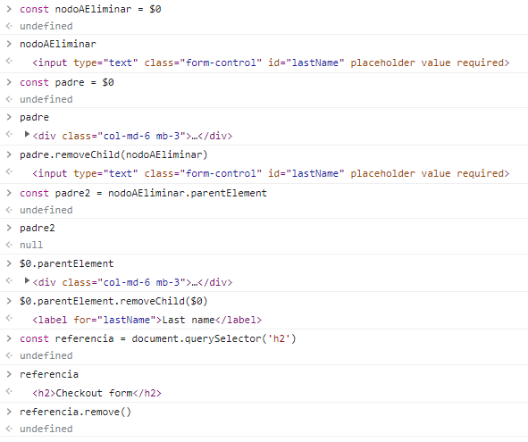
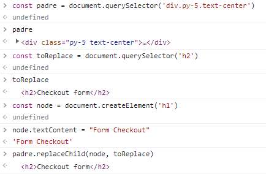

# Eliminar nodos

También debemos aprender a eliminar nodos dentro del HTML, si podemos agregarlos… ¿Por qué no podríamos eliminarlos? ¡Claro que se puede!, y para ello, JavaScript nos ofrece 3 formas:

- parentElement.removeChild(): Elimina un elemento hijo a partir del elemento padre:

```
// Nota: En la clase se hizo con $0, pero yo te lo dejo en cómo lo harías normalmente con JavaScript

// Selecciono el elemento que quiero eliminar
const nodoAEliminar = document.querySelector("selector")
// Selecciono a su padre directo
const parentElement = nodoAEliminar.parentElement
// Lo elimino
parentElement.removeChild(nodoAEliminar)
```

- docuement.remove(): Es la evolución de removeChild Y… tampoco es soportado por Internet Explorer ¬¬!
.
No importa, aquí está el polyfill:D
https://developer.mozilla.org/es/docs/Web/API/ChildNode/remove#polyfill

```
// Selecciono el elemento que quiero eliminar
const nodoAEliminar = document.querySelector("selector")

// Lo elimino uwu
nodoAEliminar.remove()
```

- document.replaceChild(): Reemplaza un nodo (en pocas palabras lo elimina y mete otro)

```
// Selecciono un padre
const padre = document.querySelector("selector")

// Selecciono el elemento al que voy a reemplazar
const toReplace = document.querySelector("selector")

// Creo el nodo por el cual lo voy a reemplazar
const node = document.createElement("h1")
// Le pongo un texto
node.textContent = "Un texto cualquiera"

// Lo reemplazo >:D!!!
parent.replaceChild(node, toReplace)
```


OTRO

<h4>Apuntes</h4>

- Existen 3 formas de eliminar nodos en el DOM

1. Remove Child
    - Podemos eliminar un nodo según a un método que proviene del padre y pasamos la referencia a eliminar
```padre.removeChild(nodoAEliminar)````

2. Remove

- Es la evolución de remove child
- No esta soportado en internet explorer
```nodoAEliminar.remove()````

3. Replace Child
- Nos permite remplazar un nodo
```padre.replaceChild(nuevoNodo, aRemplazar)````

**RESUMEN**: Podemos eliminar nodos con diferentes métodos que nos provee el DOM como ser removeChild, el cual necesita la referencia del padre a eliminar y del nodo que se eliminara, remove el cual se encarga de eliminar el nodo solo con la referencia deseada a borrar y finalmente replaceChild que nos ayuda remplazar un elemento con las referencias del padre, el nuevo nodo y el elemento a remplazar


MIO



