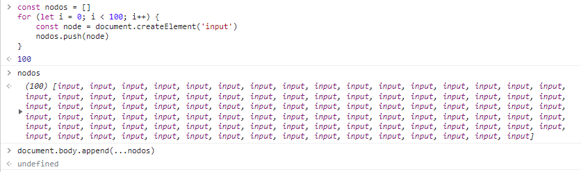

# Operaciones en lote

en consola:

```
for (let i = 0; i < 100; i++) {
    const node = document.createElement('input')
    document.body.appendChild(node)
}
```

no es muy optimo porque en cada iteración se está ejecutando appendChild, estamos modificando el DOM 100 veces (hacemos que se modifique 100 veces)


tenemos en la memoria de JavaScript 100 nodos:



```
const nodos = []
for (let i = 0; i < 100; i++) {
    const node = document.createElement('input')
    nodos.push(node)    
}
100
```

OTRO

¿Qué es el Spread Operator?
Si te causa duda esto, no te preocupes, aquí te lo explico:

El spread operator trabaja con arreglos y objetos, cuando lo pasamos en la llamada a una función, lo que hará es deconstruir ese arreglo y lo pasará como parámetros individuales para la función… aquí un ejemplo para que me entiendas:

```
function funcionQueRecibeTresParametros(param1, param2, param3) {
	// code...
}

// La forma normal de llamarla sería:
funcionQueRecibeTresParametros(1, 2, 3)

// Pero, ¿qué pasa si tengo un arreglo que contiene esos 3 parámetros?
const arregloDeParametros = [1, 2, 3]

// Bueno, pues el spread operator puede deconstruir ese arreglo y poner cada elemento en donde irían mis parámetros :D!
funcionQueRecibeTresParametros(...arregloDeParametros)

// Eso sería equivalente a esto:
funcionQueRecibeTresParametros(arregloDeParametros[0], arregloDeParametros[1], arregloDeParametros[2])
```

Esto es muy útil cuando tenemos demasiados valores, recuerda, mientras menos modifiques el DOM, más eficiente será tu programa, y recordemos que tenemos a append() que nos permite insertar múltiples elementos en el DOM en una sola llamada, ¡aprovechémoslo!
.
**Dato curioso:**
.
En algunos frameworks de JavaScript como Vue, existe una cosa llamada el Virtual DOM, no es más que un objeto JavaScript que simula al DOM real, al menos en Vue, esto tiene un proxy que está observando por cambios en ese Virtual DOM para reaccionar y renderizar solo una pequeña parte en el DOM (en lugar de reescribirlo completamente)

OTRO

Operaciones en lote
<h4>Apuntes</h4>
Realizar mutaciones en el DOM tiene un costo
Cuando usamos frameworks y liberáis lo que más cuesta en estas librerías es estar haciendo operaciones en el DOM
Entre menos operaciones realicemos en el DOM especialmente escribir y eliminar cosas más rápidas sera el website
<h3>Ejemplo: Escribir 100 inputs</h3>
<h3>🙅‍♂️ No optimo</h3>

```
for(let i = 0; i < 100; i++){
	const node = document.createElement("input");
	document.body.appendChild(node); // Modificamos 100 veces
}
```

<h3>👨‍💻 Optimo</h3>

```
const nodes  = [];
for(let i = 0; i < 100; i++){
	const node = document.createElement("input");
	nodes.push(nodes)
}
	document.body.append(...nodes); // Modificamos 1 sola vez

```

RESUMEN: Mientras menos modificaciones hagamos en el DOM mayor sera el rendimiento del website

