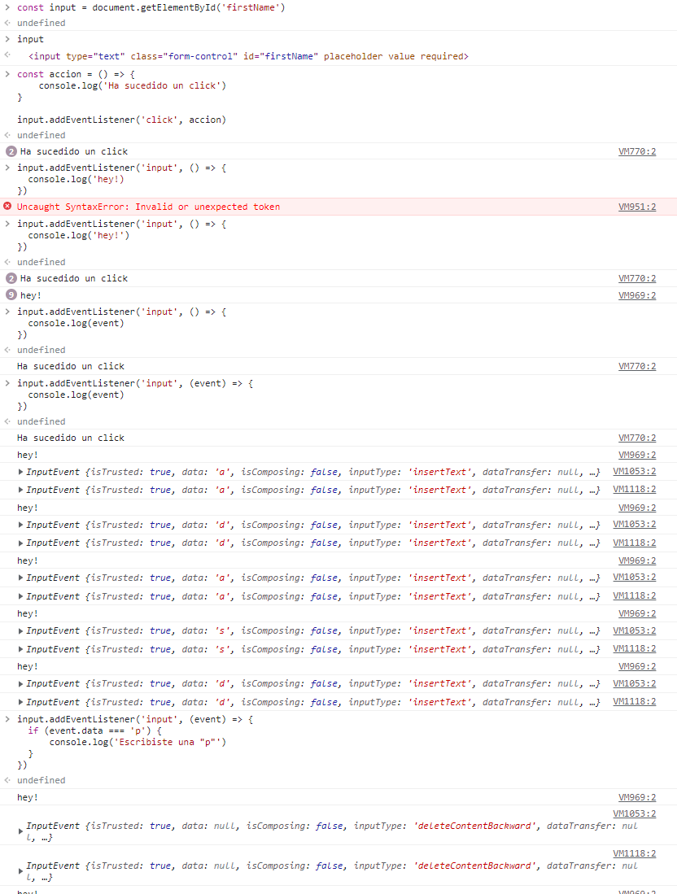
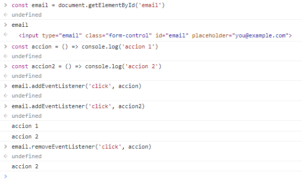

# Reaccionar a lo que sucede en el DOM

JavaScript: lenguaje basado en eventos

Trabajaremos sobre:
https://getbootstrap.com/docs/4.5/examples/checkout/






evento: console.log

target: dónde está sucediendo el evento
data: tipo de dato que se está procesando

Existen un problema con las funciones anónimas:
email.addEventListener('click', () => { console.log('algo') })
este evento no podríamos eliminarlo de nuestro elemento

Aquí pueden encontrar una lista con todos los eventos disponibles en JavaScript y a qué API pertenece
https://developer.mozilla.org/es/docs/Web/Events

OTRO

La función addEventListener() nos permite añadir eventos a nuestros elementos, la podemos usar de la siguiente manera:

```
miElemento.addEventListener("evento", manejador)
```

En este caso, el manejador debe ser una función callback que se ejecutará cuando el evento sea disparado. Es muy común verlo como una función anónima:

```
button.addEventListener("click", () => {
	alert("Me has clickado 😄")
})
```

Sin embargo, la mejor práctica es crear funciones por separado, así siempre tendremos una referencia a dicha función (con una función anónima no tenemos nada que la identifique, de ahí su nombre)

```
const miFuncionManejadora = () => {
    alert("Me has clickado 😄")
};

button.addEventListener("click", miFuncionManejadora) // Presta atención como la estamos mandando sin paréntesis, porque de esa forma solo le pasamos la referencia de la función, si le pusieramos paréntesis entonces la estaríamos ejecutando
```

Y esto tiene la ventaja de que podemos remover los eventos cuando queramos ya que tenemos la referencia de la función manejadora 😄

```
const miFuncionManejadora = () => {
    alert("Me has clickado 😄")
};

// Agrego el evento
button.addEventListener("click", miFuncionManejadora)

// Quito el evento
button.removeEventListener("click", miFuncionManejadora)
```

También podemos definir funciones de esta otra manera 👀

```
button.onClick = () => {
    alert("Me has clickado 😄")
}
```

Esta sintaxis es onEvento pero no es muy común ^^
.
Como dato adicional, esta es otra forma de añadir eventos desde HTML:
.
HTML

```
<button onclick="miFuncionManejadora">Clicame</button>
```

JavaScript

```
const miFuncionManejadora = () => {
    alert("Me has clickado 😄")
};
```

De esta forma, el botón, mediante un atributo estaría llamando a la función 😄

------
OTRO


Reaccionar a lo que sucede en el DOM
<h4>Ideas / conceptos claves</h4>
Una función anónima es una definición de función que no está vinculada a un identificador

<h4>Apuntes</h4>
JS es un lenguaje que está basado en eventos
✨ Toda la magia sucede cuando escuchamos los eventos y reaccionamos con lo que sucede

<h3>Eventos</h3> <h4>Add Event Listener</h4>
Agrega un evento
node.addEventListener(tipoDeEvento, callback)
Todos los eventos envían información del evento como un parámetro al callback
Existen eventos específicos para elementos HTML especiales como ser video o audio
<h4>Remove Event Listener</h4>
Elimina un evento
Debemos especificar el tipo de evento y la referencia de la función al momento de invocar el método del elemento HTML
Es recomendable si deseamos eliminar eventos a futuro no crear funciones anónimas por que se perderá la referencia
node.removeEventListener(tipoDeEvento, callback)
RESUMEN: Todos los elementos del DOM pueden tener las propiedades para agregar o eliminar eventos según diferentes acciones. Algunos elementos tienen acciones específicas como ser los videos o audios


### Lecturas recomendadas

- [Event reference | MDN](https://developer.mozilla.org/en-US/docs/Web/Events)