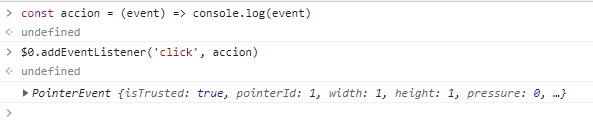
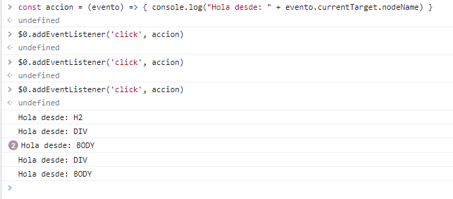
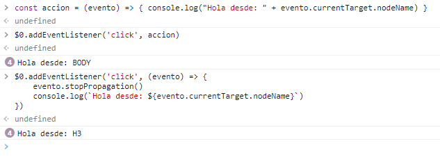

# Event propagation

Básicamente la propagación de eventos se produce cuando tienes puestos algunos eventos en contenedores que son hijos de otro, por ejemplo:

```
<div id="div1">
    <div id="div2">
        <div id="div3">
            Hola
        </div>
    </div>
</div>
```

Si le ponemos un event listener a los 3 divs, y clicas dentro del div 3, también estás clicando el div2 (porque el div3 está dentro del div2), y a su vez estás clicando el div1 (porque estos 2 divs están dentro de div1), por tanto, el evento se va a propagar hacia los 3 divs.
.
La forma de deterlo es usando el método stopPropagation() que viene dentro del argumento event que cualquier evento nos provee, por tanto, yo puedo decirle al div3: “Oiga, yo solo lo quiero clicar a usted, no a los demás, sí, ya se que usted está dentro de los demás, pero yo solo lo quiero a usted”, de tal forma que al event listener del programation le puedo poner:

```
div3.addEventListener("click", event => {

    event.stopPropagation()

});
```

De esta forma, el evento de div2 y div1 no serán ejecutados
.
Dato curioso, cuando tu defines un elemento con un ID en HTML, en JavaScript se crea automágicamente una variable con ese id que creaste, por eso es completamente posible que yo pueda usar la variable div3 sin tener que seleccionar el elemento 👀


OTRO

Event propagation
<h4>Ideas/conceptos claves</h4>
Bubbling es la forma en que se propaga desde lo más bajo hasta lo más alto

<h4>Apuntes</h4>
El DOM es un arbol que renderiza nodos de forma jerárquica
Cuando un evento sucede se propaga a lo largo de ese nodo
Los eventos suceden desde el elemento más interno hacia afuera
Propagándose entre cada padre que tiene el elemento escuchado
Si deseamos borrar este comportamiento podemos usar el parámetro de evento

```
node.addEventListener("click", (event) => {
	event.stopPropagation()
	// Acciones ...
});
```
Se debe tener cuidado con este tipo de operaciones por que puede existir códigos de otras personas o de librerías que necesiten este tipo de eventos
Por lo general se debería dejar que los eventos fluyan por su ruta
RESUMEN: Cuando se tiene eventos estos pueden flotar desde el más específico hasta el más grande, si se desea quitar este comportamiento se puede usar el método del parámetro del evento stopPropagation por lo general no es necesario usar este método

MIO

nodeName = nombre del nodo

En el ejemplo el evento se propaga hasta el elemento más externo:




