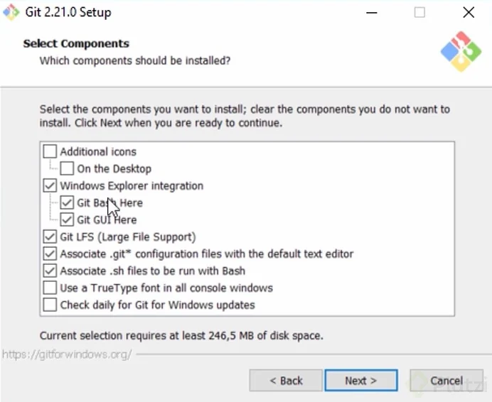
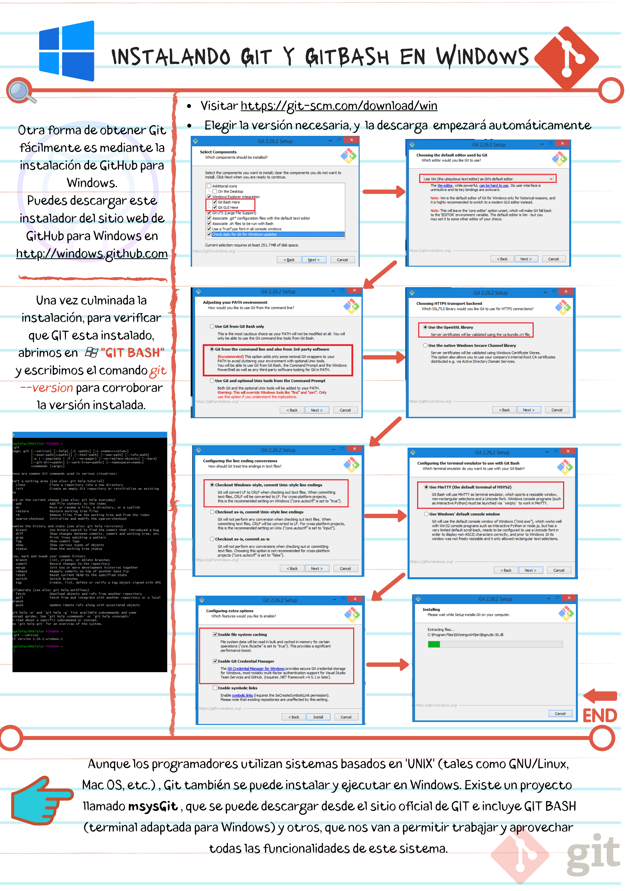

# Instalando Git y GitBash en Windows

Windows y Linux tienen comandos diferentes, graban el enter de formas diferentes y tienen muchas otras diferencias. Cuando instales Git Bash en Windows debes elegir si prefieres trabajar con la forma de Windows o la forma de UNIX (Linux y Mac).

Ten en cuenta que, normalmente, los entornos de desarrollo profesionales tienen personas que usan sistemas operativos diferentes. Esto significa que, si todos podemos utilizar los mismos comandos, el trabajo resultará más fácil para todos en el equipo.

Los comandos de UNIX son los más comunes entre los equipos de desarrollo. Así que, a menos que trabajes con tecnologías nativas de Microsoft (por ejemplo, .NET), la recomendación es que elijas la opción de la terminal tipo UNIX para obtener una mejor compatibilidad con todo tu equipo.

## Cómo instalar Git en Windows

Para instalar este sistema de control de versiones en Windows, simplemente vas al [repositorio de descarga](https://git-scm.com/downloads). Luego de descargarlo, lo ejecutas como cualquier otra aplicación de Windows.

Al momento de iniciar el instalador, asegúrate de haber marcado la opción de instalar Git Bash en el computador (que es lo que nos permitirá correr comandos de Linux en la consola sin problemas para trabajar con Git).

Otra forma de obtener Git fácilmente en tu computador, es descargando GitHub para Windows. Aquí puedes encontrar el [instalador de GitHub](https://desktop.github.com/).

### Notas

