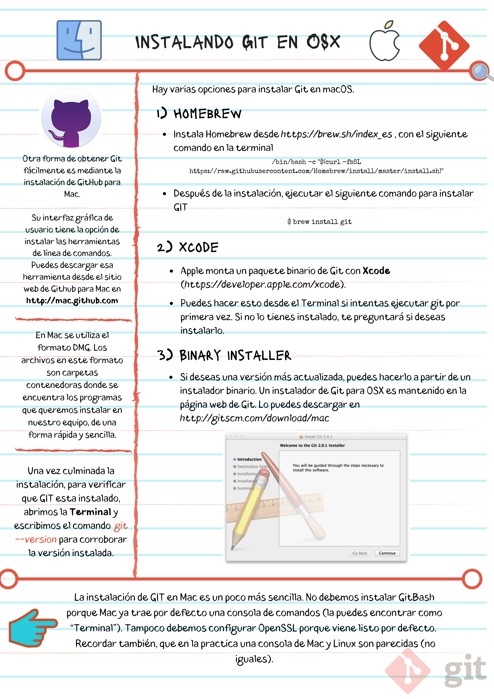

# Instalando Git en OSX

En Mac, Git está instalado en el sistema operativo por defecto. Este instalador no es realmente necesrario.

Puedes verificar que tienes instalado Git desde el terminal usando el comando:
```git --version```

Esto deberia generar una respuesta similar a esta:
```git version 1.9.3 (Apple Git-50)```

## Cómo actualizar Git en Mac

Si quieres actualizar Git a su última versión, se puede hacer de manera simple usando Homebrew, al que accedes también desde la consola. Lo actualizas con el siguiente código:

```brew upgrade git```

En caso de necesitarlo, la instalación de GIT en Mac es un poco más sencilla. No debemos instalar GitBash porque Mac ya trae por defecto una consola de comandos (la puedes encontrar como “Terminal”). Tampoco debemos configurar OpenSSL porque viene listo por defecto.

OSX está basado en un Kernel de UNIX llamado BSD. Estos significa que hay algunas diferencias entre las consolas de Mac y Linux. Pero no vas a notar la diferencia a menos que trabajes con acceso profundo a las interfaces de red o los archivos del sistema operativo. Ambas consolas funcionan muy parecido y comparten los comandos que vamos a ver durante el curso.

Puedes descargar Git aquí: https://git-scm.com

Puedes verificar que Git fue instalado correctamente con el comando ```git --version```.

### Notas


