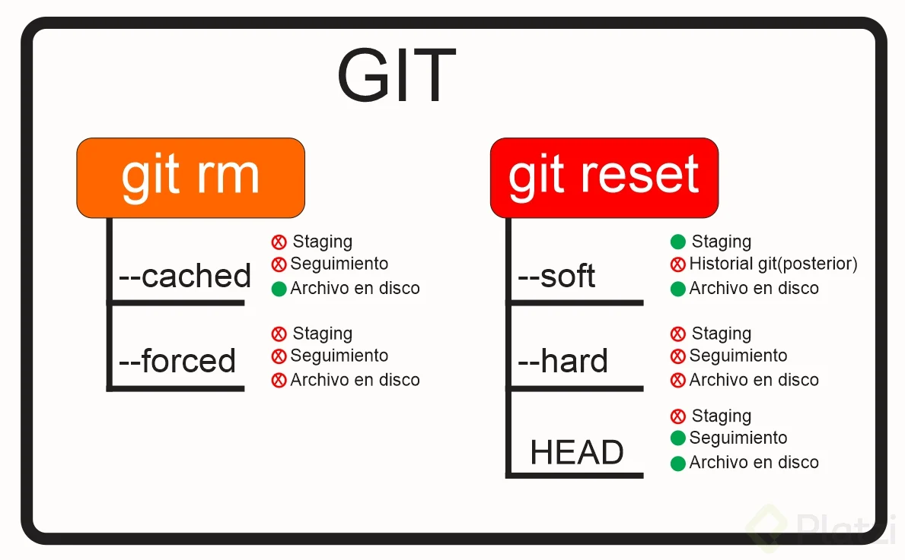
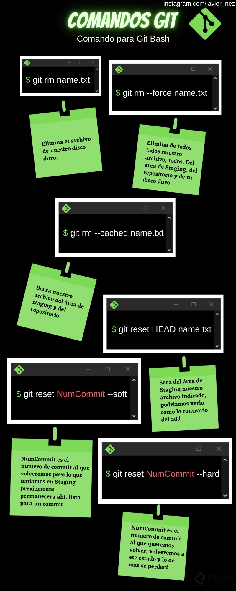

# Git reset vs. Git rm

Git reset y git rm son comandos con utilidades muy diferentes, pero se pueden confundir muy fácilmente.

## git rm

Este comando nos ayuda a eliminar archivos de Git sin eliminar su historial del sistema de versiones. Esto quiere decir que si necesitamos recuperar el archivo solo debemos “viajar en el tiempo” y recuperar el último commit antes de borrar el archivo en cuestión.

Recuerda que ```git rm``` no puede usarse así nomás. Debemos usar uno de los flags para indicarle a Git cómo eliminar los archivos que ya no necesitamos en la última versión del proyecto:

- ```git rm --cached```: Elimina los archivos de nuestro repositorio local y del área de staging, pero los mantiene en nuestro disco duro. Básicamente le dice a Git que deje de trackear el historial de cambios de estos archivos, por lo que pasaran a un estado untracked.

- ```git rm --force```: Elimina los archivos de Git y del disco duro. Git siempre guarda todo, por lo que podemos acceder al registro de la existencia de los archivos, de modo que podremos recuperarlos si es necesario (pero debemos usar comandos más avanzados).

## git reset

Este comando nos ayuda a volver en el tiempo. Pero no como ```git checkout``` que nos deja ir, mirar, pasear y volver. Con ```git reset``` volvemos al pasado sin la posibilidad de volver al futuro. Borramos la historia y la debemos sobreescribir. No hay vuelta atrás.

Este comando es **muy peligroso** y debemos emplearlo solo en caso de emergencia. Recuerda que debemos usar alguna de estas dos opciones:

Hay dos formas de utilizar ```git reset```: con el argumento --hard, borrando toda la información que tengamos en el área de staging (y perdiendo todo para siempre). O, un poco más seguro, con el argumento --soft, que mantiene allí los archivos del área de staging para que podamos aplicar nuestros últimos cambios pero desde un commit anterior.

- ```git reset --soft```: Borramos todo el historial y los registros de Git pero guardamos los cambios que tengamos en Staging, así podemos aplicar las últimas actualizaciones a un nuevo commit.
- ```git reset --hard```: Borra todo. Todo todito, absolutamente todo. Toda la información de los commits y del área de staging se borra del historial.

### ¡Pero todavía falta algo!

- ```git reset HEAD```: Este es el comando para sacar archivos del área de staging. No para borrarlos ni nada de eso, solo para que los últimos cambios de estos archivos no se envíen al último commit, a menos que cambiemos de opinión y los incluyamos de nuevo en staging con git add, por supuesto.

## La relevancia de estos comandos

Imagina el siguiente caso:

Hacemos cambios en los archivos de un proyecto para una nueva actualización. Todos los archivos con cambios se mueven al área de staging con el comando ```git add```. Pero te das cuenta de que uno de esos archivos no está listo todavía. Actualizaste el archivo, pero ese cambio no debe ir en el próximo commit por ahora.

¿Qué podemos hacer?

Bueno, todos los cambios están en el área de Staging, incluido el archivo con los cambios que no están listos. Esto significa que debemos sacar ese archivo de Staging para poder hacer commit de todos los demás.

¡Al usar ```git rm``` lo que haremos será eliminar este archivo completamente de git! Todavía tendremos el historial de cambios de este archivo, con la eliminación del archivo como su última actualización. Recuerda que en este caso no buscábamos eliminar un archivo, solo dejarlo como estaba y actualizarlo después, no en este commit.

En cambio, si usamos ```git reset HEAD```, lo único que haremos será mover estos cambios de Staging a Unstaged. Seguiremos teniendo los últimos cambios del archivo, el repositorio mantendrá el archivo (no con sus últimos cambios, pero sí con los últimos en los que hicimos commit) y no habremos perdido nada.

**Conclusión**: Lo mejor que puedes hacer para salvar tu puesto y evitar un incendio en tu trabajo es conocer muy bien la diferencia y los riesgos de todos los comandos de Git.

### Notas




