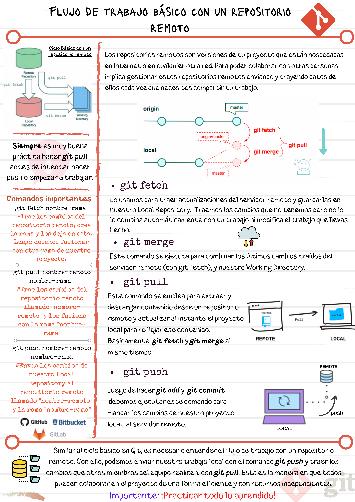

# Flujo de trabajo básico con un repositorio remoto

Cuando empiezas a trabajar en un entorno local, el proyecto vive únicamente en tu computadora. Esto significa que no hay forma de que otros miembros del equipo trabajen en él.

Para solucionar esto, utilizamos los servidores remotos: un nuevo estado que deben seguir nuestros archivos para conectarse y trabajar con equipos de cualquier parte del mundo.

Estos servidores remotos pueden estar alojados en GitHub, GitLab, BitBucket, entre otros. Lo que van a hacer es guardar el mismo repositorio que tienes en tu computadora y darnos una URL con la que todos podremos acceder a los archivos del proyecto. Así, el equipo podrá descargarlos, hacer cambios y volverlos a enviar al servidor remoto para que otras personas vean los cambios, comparen sus versiones y creen nuevas propuestas para el proyecto.

Esto significa que debes aprender algunos nuevos comandos

## Comandos para trabajo remoto con GIT

- ```git clone url_del_servidor_remoto```: Nos permite descargar los archivos de la última versión de la rama principal y todo el historial de cambios en la carpeta ```.git```.
- ```git push```: Luego de hacer ```git add``` y ```git commit``` debemos ejecutar este comando para mandar los cambios al servidor remoto.
- ```git fetch```: Lo usamos para traer actualizaciones del servidor remoto y guardarlas en nuestro repositorio local (en caso de que hayan, por supuesto).
- ```git merge```: También usamos el comando ```git merge``` con servidores remotos. Lo necesitamos para combinar los últimos cambios del servidor remoto y nuestro directorio de trabajo.
- ```git pull```: Básicamente, ```git fetch``` y ```git merge``` al mismo tiempo.

Adicionalmente, tenemos otros comandos que nos sirven para trabajar en proyectos muy grandes:

- **git log --oneline**:Te muestra el id commit y el título del commit.
- **git log --decorate**: Te muestra donde se encuentra el head point en el log.
- **git log --stat**: Explica el número de líneas que se cambiaron brevemente.
- **git log -p**: Explica el número de líneas que se cambiaron y te muestra que se cambió en el contenido.
- **git shortlog**: Indica que commits ha realizado un usuario, mostrando el usuario y el título de sus commits.
- **git log --graph --oneline --decorate** y
- **git log --pretty=format:"%cn hizo un commit %h el dia %cd"**: Muestra mensajes personalizados de los commits.
- **git log -3**: Limitamos el número de commits.
- **git log --after=“2018-1-2”**
- **git log --after=“today”** y
- **git log --after=“2018-1-2” --before=“today”**: Commits para localizar por fechas.
- **git log --author=“Name Author”**: Commits hechos por autor que cumplan exactamente con el nombre.
- **git log --grep=“INVIE”**: Busca los commits que cumplan tal cual está escrito entre las comillas.
- **git log --grep=“INVIE” –i**: Busca los commits que cumplan sin importar mayúsculas o minúsculas.
- **git log – index.html**: Busca los commits en un archivo en específico.
- **git log -S “Por contenido”**: Buscar los commits con el contenido dentro del archivo.
- **git log > log.txt**: guardar los logs en un archivo txt


### Notas

