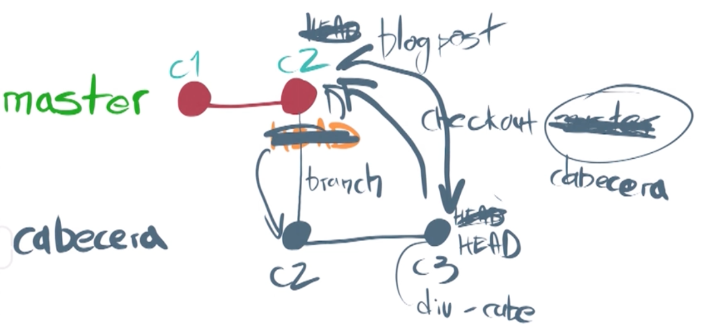

# Introducción a las ramas o branches de Git

Las ramas (branches) son la forma de hacer cambios en nuestro proyecto sin afectar el flujo de trabajo de la rama principal. Esto porque queremos trabajar una parte muy específica de la aplicación o simplemente experimentar.

La cabecera o ```HEAD``` representan la rama y el commit de esa rama donde estamos trabajando. Por defecto, esta cabecera aparecerá en el último commit de nuestra rama principal. Pero podemos cambiarlo al crear una rama (```git branch rama```, ```git checkout -b rama```) o movernos en el tiempo a cualquier otro commit de cualquier otra rama con los comandos (```git reset id-commit```, ```git checkout rama-o-id-commit```).

## Cómo funcionan las ramas en GIT

Las ramas son la manera de hacer cambios en nuestro proyecto sin afectar el flujo de trabajo de la rama principal. Esto porque queremos trabajar una parte muy específica de la aplicación o simplemente experimentar.

- **git branch -nombre de la rama-**: Con este comando se genera una nueva rama.

- **git checkout -nombre de la rama-**: Con este comando puedes saltar de una rama a otra.

- **git checkout -b rama**: Genera una rama y nos mueve a ella automáticamente, Es decir, es la combinación de git brach y git checkout al mismo tiempo.

- **git reset id-commit**: Nos lleva a cualquier commit no importa la rama, ya que identificamos el id del tag., eliminando el historial de los commit posteriores al tag seleccionado.

- **git checkout rama-o-id-commit**: Nos lleva a cualquier commit sin borrar los commit posteriores al tag seleccionado.



### Notas

