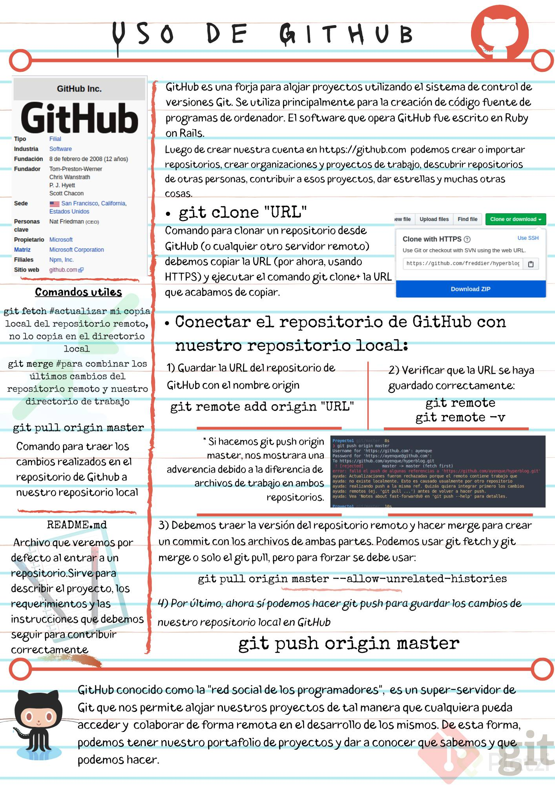

# Uso de GitHub

**GitHub** es una plataforma que nos permite guardar repositorios de Git que podemos usar como servidores remotos y ejecutar algunos comandos de forma visual e interactiva (sin necesidad de la consola de comandos).

Luego de crear nuestra cuenta, podemos crear o importar repositorios, crear organizaciones y proyectos de trabajo, descubrir repositorios de otras personas, contribuir a esos proyectos, dar estrellas y muchas otras cosas.

El ```README.md``` es el archivo que veremos por defecto al entrar a un repositorio. Es una muy buena práctica configurarlo para describir el proyecto, los requerimientos y las instrucciones que debemos seguir para contribuir correctamente.

Para clonar un repositorio desde GitHub (o cualquier otro servidor remoto) debemos copiar la URL (por ahora, usando ```HTTPS```) y ejecutar el comando ```git clone + la URL``` que acabamos de copiar. Esto descargará la versión de nuestro proyecto que se encuentra en GitHub.

Sin embargo, esto solo funciona para las personas que quieren empezar a contribuir en el proyecto.

## Cómo conectar un repositorio de GitHub a nuestro documento local

Si queremos conectar el repositorio de GitHub con nuestro repositorio local, que creamos usando el comando ```git init```, debemos ejecutar las siguientes instrucciones:

1. Guardar la URL del repositorio de GitHub con el nombre de origin

```
git remote add origin URL
```

2. Verificar que la URL se haya guardado correctamente:

```
git remote
git remote -v
```

3. Traer la versión del repositorio remoto y hacer *merge* para crear un *commit* con los archivos de ambas partes. Podemos usar ```git fetch``` y ```git merge``` o solo ```git pull``` con el flag ```--allow-unrelated-histories```:

```
git pull origin master --allow-unrelated-histories
````

4. Por último, ahora sí podemos hacer ```git push``` para guardar los cambios de nuestro repositorio local en GitHub:

```
git push origin master
```

## Cómo autenticarte en GitHub 2022

Antes de empezar debemos renombrar la rama ‘máster’ a ‘main’, este es el nuevo estándar en GitHub, para esto:

1. Primero nos posicionamos en la rama a la que queremos cambiarle el nombre.
2. Ejecutamos el siguiente comando: ```git branch -M main```

**Pasos para crear un token de acceso personal**.

**Desde el 2022 GitHub** ya no deja hacer el push con la contraseña del propio GitHub, para esto tenemos que crear un token, y este token es la contraseña que vamos a colocar cuando nos pida clave

Seguir la secuencia: Ingresamos a nuestra cuenta de GitHub.

1. Buscamos ```Settings```
2. Click en ```Developer settings```
3. Click en ```Personal access tokens```
4. Click en ```Generate new token``` aquí se puede colocar un nombre, la fecha de expiración.
5. Tildar en repo y luego click en el botón verde ```Generate token```

### Notas

