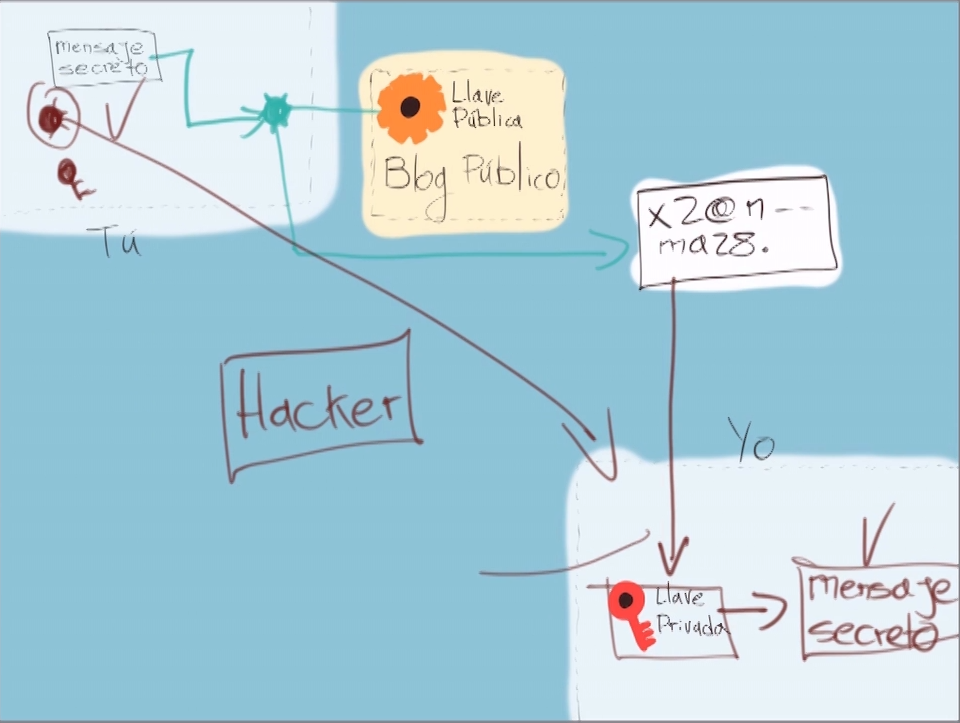
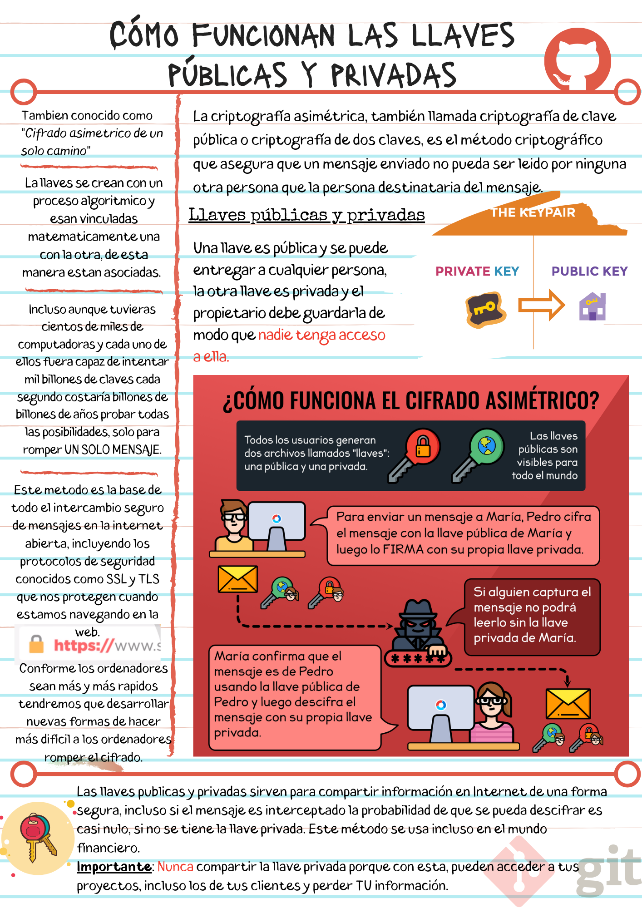

# Cómo funcionan las llaves públicas y privadas

Las **llaves públicas y privadas**, conocidas también como cifrado asimétrico de un solo camino, sirven para mandar mensajes privados entre varios nodos con la lógica de que firmas tu mensaje con una llave pública vinculada con una llave privada que puede leer el mensaje.

Las llaves públicas y privadas nos ayudan a cifrar y descifrar nuestros archivos de forma que los podamos compartir sin correr el riesgo de que sean interceptados por personas con malas intenciones.

## Cómo funciona un mensaje cifrado con llaves públicas y privadas

1. Ambas personas deben crear su llave pública y privada.
2. Ambas personas pueden compartir su llave pública a las otras partes (recuerda que esta llave es pública, no hay problema si la "interceptan").
3. La persona que quiere compartir un mensaje puede usar la llave pública de la otra persona para cifrar los archivos y asegurarse que solo puedan ser descifrados con la llave privada de la persona con la que queremos compartir el mensaje.
4. El mensaje está cifrado y puede ser enviado a la otra persona sin problemas en caso de que los archivos sean interceptados.
5. La persona a la que enviamos el mensaje cifrado puede emplear su llave privada para descifrar el mensaje y ver los archivos.

Nota: puedes compartir tu llave pública, pero nunca tu llave privada.

### Notas

