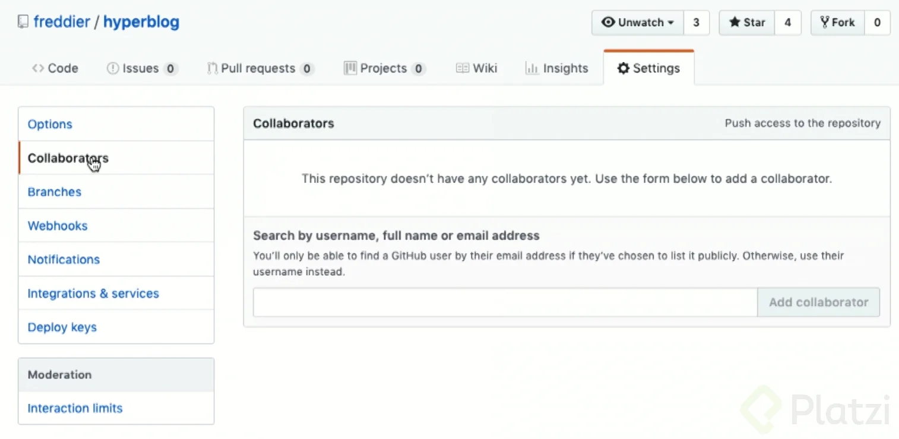
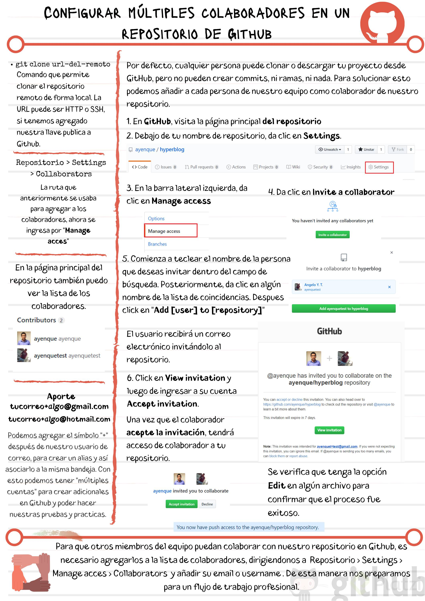

# Configurar múltiples colaboradores en un repositorio de GitHub

Por defecto, cualquier persona puede clonar o descargar tu proyecto desde GitHub, pero no pueden crear commits, ni ramas. Esto quiere decir que pueden copiar tu proyecto pero no colaborar con él. Existen varias formas de solucionar esto para poder aceptar contribuciones. Una de ellas es añadir a cada persona de nuestro equipo como colaborador de nuestro repositorio.

## Cómo agregar colaboradores en Github

- Solo debemos entrar a la configuración de colaboradores de nuestro proyecto. Se encuentra en:

```
Repositorio > Settings > Collaborators
```

Ahí, debemos añadir el email o username de los nuevos colaboradores.



Si, como colaborador, agregaste erróneamente el mensaje del commit, lo puedes cambiar de la siguiente manera:

- Hacer un *commit* con el nuevo mensaje que queremos, esto nos abre el editor de texto de la terminal:

```git commit —amend```

- Corregimos el mensaje

- Traer el repositorio remoto

```git pull origin master```

- Ejecutar el cambio

```git push --set-upstream origin master```

### Notas

