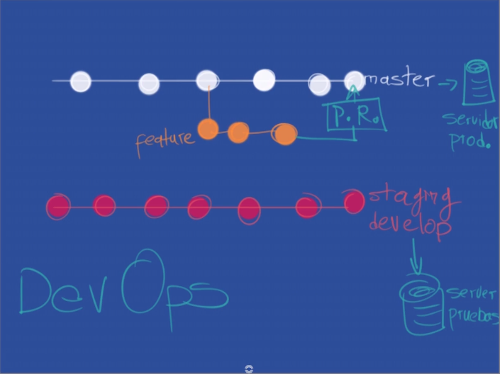
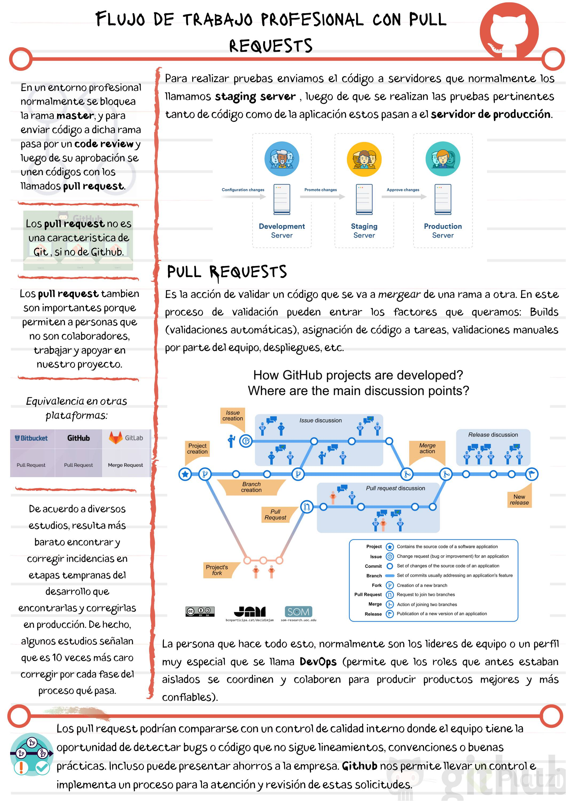

# Flujo de trabajo profesional con Pull requests

En un entorno profesional normalmente se bloquea la rama **master**, y para enviar código a dicha rama pasa por un *code review* y luego de su aprobación se unen códigos con los llamados *merge request*.

Para realizar pruebas enviamos el código a servidores que normalmente los llamamos *staging develop* (servidores de pruebas) luego de que se realizan las pruebas pertinentes tanto de código como de la aplicación estos pasan al servidor de producción con el ya antes mencionado *merge request*.

Los PR (pull requests) son la base de la colaboración a proyectos Open Source, si tienen pensando colaborar en alguno es muy importante entender esto y ver cómo se hace en las próximas clases. Por lo general es forkear el proyecto, implementar el cambio en una nueva rama, hacer el PR y esperar que los administradores del proyecto hagan el merge o pidan algún cambio en el código o commits que hiciste.

## Proceso de un pull request para trabajo en producción:

- Un pull request es un estado intermedio antes de enviar el merge.
- El pull request permite que otros miembros del equipo revisen el código y así aprobar el merge a la rama.
- Permite a las personas que no forman el equipo, trabajar y colaborar con una rama.
- La persona que tiene la responsabilidad de aceptar los pull request y hacer los merge tienen un perfil especial y son llamados DevOps

### Notas

