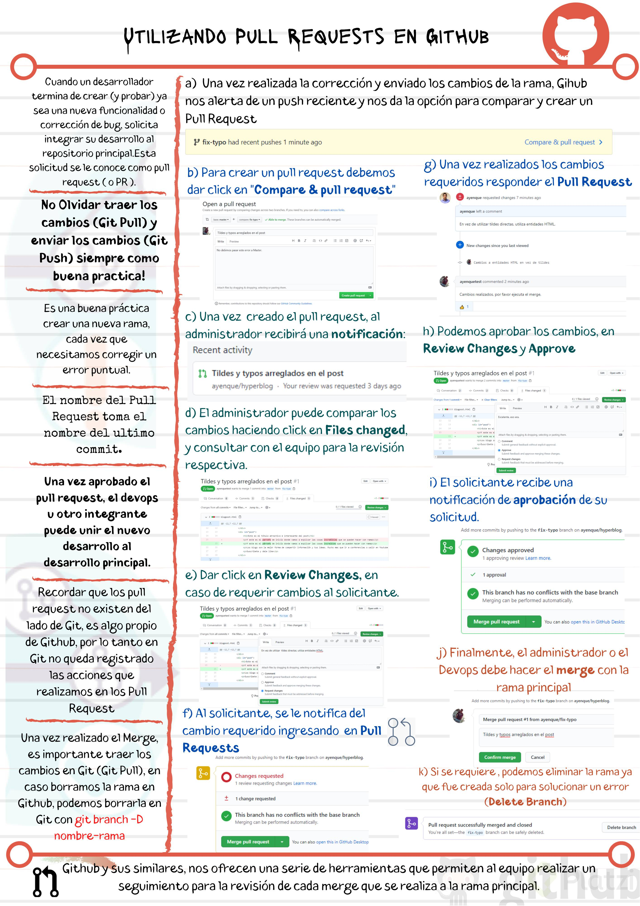

# Utilizando Pull Requests en GitHub

**Pull request** es una funcionalidad de Github (en Gitlab llamada *merge request* y en Bitbucket *push request*), en la que un colaborador pide que revisen sus cambios antes de hacer merge a una rama, normalmente master (ahora conocida como main).

Al hacer un pull request, se genera una conversación que pueden seguir los demás usuarios del repositorio, así como autorizar y rechazar los cambios.

## Cómo se realiza un pull request

- Se trabaja en una rama paralela los cambios que se desean ```git checkout -b <rama>```.
- Se hace un commit a la rama ```git commit -am '<Comentario>'```.
- Se suben al remoto los cambios ```git push origin <rama>```.
- En GitHub se hace el pull request comparando la rama master con la rama del fix.
- Uno, o varios colaboradores revisan que el código sea correcto y dan feedback (en el chat del pull request).
- El colaborador hace los cambios que desea en la rama y lo vuelve a subir al remoto (automáticamente jala la historia de los cambios que se hagan en la rama, en remoto).
- Se aceptan los cambios en GitHub.
- Se hace merge a master desde GitHub.

**Importante**: Cuando se modifica una rama, también se modifica el pull request.

### Notas


