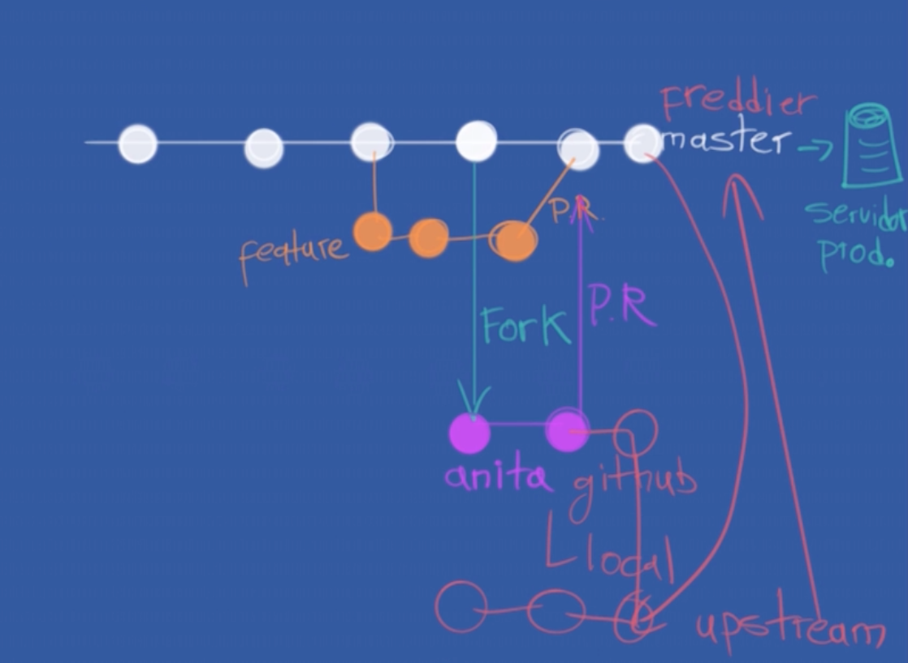

# Creando un Fork, contribuyendo a un repositorio

Los **forks o bifurcaciones** son una característica única de GitHub en la que se crea una copia exacta del estado actual de un repositorio directamente en GitHub. Este repositorio podrá servir como otro origen y se podrá clonar (como cualquier otro repositorio). En pocas palabras, lo podremos utilizar como un nuevo repositorio git cualquiera

Un fork es como una bifurcación del repositorio completo. Comparte una historia en común con el original, pero de repente se bifurca y pueden aparecer varios cambios, ya que ambos proyectos podrán ser modificados en paralelo y para estar al día un colaborador tendrá que estar actualizando su *fork* con la información del original.

Al hacer un fork de un proyecto en GitHub, te conviertes en dueñ@ del repositorio fork, puedes trabajar en este con todos los permisos, pero es un repositorio completamente diferente que el original, teniendo solamente alguna historia en común (como crédito al creado o creadora original).

Los forks son importantes porque es la manera en la que funciona el open source, ya que, una persona puede no ser colaborador de un proyecto, pero puede contribuír al mismo, haciendo mejor software que pueda ser utilizado por cualquiera.

## Cómo se hace un fork remoto desde consola en GitHub

Al hacer un fork, GitHub sabe que se hizo el fork del proyecto, por lo que se le permite al colaborador hacer pull request desde su repositorio propio.

Cuando trabajas en un proyecto que existe en diferentes repositorios remotos (normalmente a causa de un fork), es muy probable que desees poder trabajar con ambos repositorios. Para esto, puedes generar un remoto adicional desde consola.

```
git remote add <nombre_del_remoto> <url_del_remoto> 
git remote upstream https://github.com/freddier/hyperblog
```

Al crear un remoto adicional, podremos hacer pull desde el nuevo origen. En caso de tener permisos, podremos hacer fetch y push.

```
git pull <remoto> <rama>
git pull upstream master
```

Este pull nos traerá los cambios del remoto, por lo que se estará al día en el proyecto. El flujo de trabajo cambia, en adelante se estará trabajando haciendo pull desde el upstream y push al origin para pasar a hacer pull request.

```
git pull upstream master
git push origin master
```



### Notas

