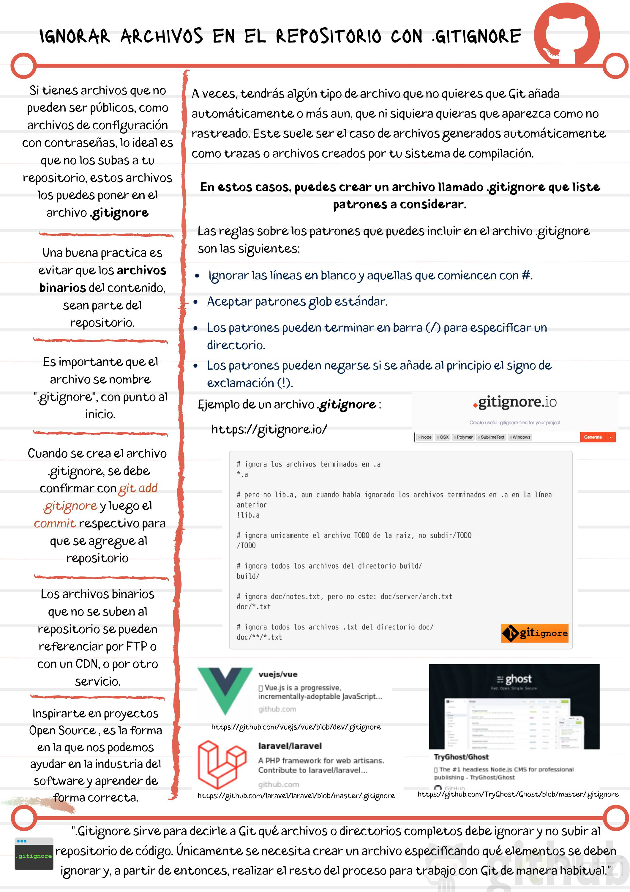

# Ignorar archivos en el repositorio con .gitignore

No todos los archivos que agregas a un proyecto deberían ir a un repositorio. Por ejemplo, cuando tienes un archivo donde están tus contraseñas que comúnmente tienen la extensión ```.env``` o cuando te estás conectando a una base de datos; **son archivos que nadie debe ver**.

Por diversas razones, no todos los archivos que agregas a un proyecto deberían guardarse en un repositorio. Esto es porque hay archivos que no todo el mundo debería de ver, y hay archivos que al estar en el repositorio ralentizan el proceso de desarrollo (por ejemplo: los binary large objects, blob, que tardan en descargarse).

Para que no se suban estos archivos no deseados se puede crear un archivo con el nombre .gitignore en la raíz del repositorio con las reglas para los archivos que no se deberían subir: Aquí puedes ver la sintaxis de [los .gitignore](https://git-scm.com/docs/gitignore).

Las razones principales para tomar la decisión de no agregar un archivo a un repositorio son:

- Es un archivo con contraseñas (normalmente con la extensión .env).
- Es un blob (binary large object, objeto binario grande), mismos que son difíciles de gestionar en git.
- Son archivos que se generan corriendo comandos, por ejemplo la carpeta node_modules, que genera **npm** al correr el comando npm install.

### Notas



### Lecturas recomendadas

- [Git - gitignore Documentation](https://git-scm.com/docs/gitignore)
- [Imgur: The magic of the Internet](https://imgur.com/)

VER:

Paso a paso para utilizar imgur

- entra en la pagina
- sube la imagen (no es necesario estar registrado)
- copia la direccion url que se le asigna a la imagen
- en tu archivo html dentro la etiqueta para un nuevo parrafo escribre la etiqueta para crear una nueva ancla <a></a>
- dentro de los signo de la primera a escribe el vinculo href=tu_url
- dentro de la etiqueta para el ancla escribe la etiqueta de la imagen espesificando la direccion, la cual sera igual a la direccion del hipervinculo pero con una i al principio y terminando con .jpg
- cierras la etiqueta de ancla y cierras la etiqueta del parrafo
- ejemplo
````
<p><a href="https://imgur.com/P0uCD21"></a></p>
````