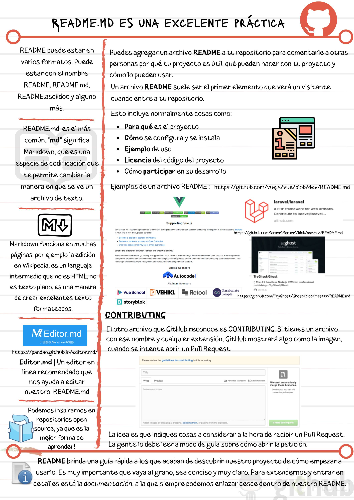

# Readme.md es una excelente práctica

```README.md``` es el lugar donde se explica de qué trata el proyecto, cómo utilizarlo y demás información que se considere que se deba conocer cualquier persona que vaya a trabajar de alguna forma con el proyecto.

Los archivos README son escritos en un lenguaje llamado **markdown**, por eso la extensión .md, mismo que es un estándar de escritura en diversos sitios (como Platzi, Wikipedia y el mismo GitHub). Aquí puedes ver las [reglas de markdown](https://www.markdownguide.org/extended-syntax).

Los [README.md](https://changelog.md/) pueden estar en todas las carpetas, pero el más importante es el que se encuentra en la raíz. Este documento ayuda a que los colaboradores sepan información relevante del proyecto, módulo o sección. Puedes crear cualquier archivo con la extensión .md pero solo los [README.md](https://changelog.md/) los mostrará por defecto GitHub.

### Notas



### Lecturas recomendadas

- [Editor.md](https://pandao.github.io/editor.md/en.html)