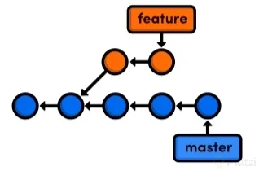
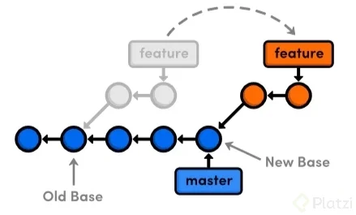
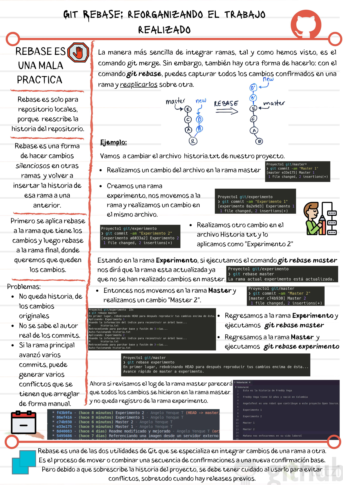

# Git Rebase: reorganizando el trabajo realizado

Rebase es el proceso de mover o combinar una secuencia de confirmaciones en una nueva confirmación base. La reorganización es muy útil y se visualiza fácilmente en el contexto de un flujo de trabajo de ramas de funciones. El proceso general se puede visualizar de la siguiente manera.



Para hacer un rebase en la rama feature de la rama master, correrías los siguientes comandos:

```
git checkout feature
git rebase master
```

Esto *trasplanta* la rama feature desde su locación actual hacia la punta de la rama master:



Ahora, falta fusionar la rama feature con la rama master

```
git checkout master
git rebase feature
# No reorganices el historial público
```

Nunca debes reorganizar las confirmaciones una vez que se hayan enviado a un repositorio público. La reorganización sustituiría las confirmaciones antiguas por las nuevas y parecería que esa parte del historial de tu proyecto se hubiera desvanecido de repente.

El comando **rebase** es **_una mala práctica, sobre todo en repositorios remotos. Se debe evitar su uso, pero para efectos de práctica te lo vamos a mostrar, para que hagas tus propios experimentos. Con ```rebase``` puedes recoger todos los cambios confirmados en una rama y ponerlos sobre otra.

```
# Cambiamos a la rama que queremos traer los cambios
git checkout experiment
# Aplicamos rebase para traer los cambios de la rama que queremos 
git rebase master
```

### Notas

