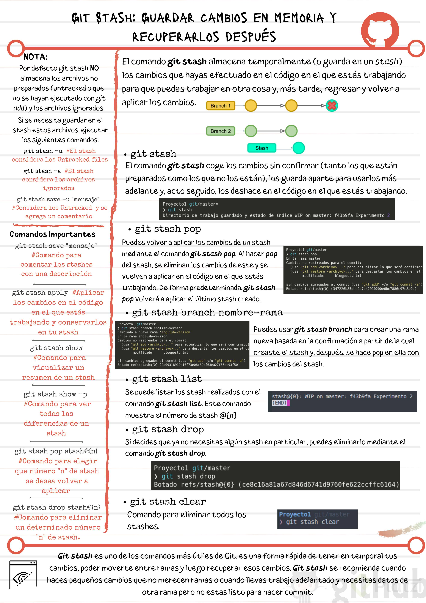

# Git Stash: Guardar cambios en memoria y recuperarlos después

El *stashed* nos sirve para guardar cambios para después, Es una lista de estados que nos guarda algunos cambios que hicimos en Staging para poder cambiar de rama sin perder el trabajo que todavía no guardamos en un commit

Ésto es especialmente útil porque hay veces que no se permite cambiar de rama, ésto porque tenemos cambios sin guardar, no siempre es un cambio lo suficientemente bueno como para hacer un commit, pero no queremos perder ese código en el que estuvimos trabajando.

El stashed nos permite cambiar de ramas, hacer cambios, trabajar en otras cosas y, más adelante, retomar el trabajo con los archivos que teníamos en Staging, pero que podemos recuperar, ya que los guardamos en el Stash.

## git stash

El comando git stash guarda el trabajo actual del Staging en una lista diseñada para ser temporal llamada Stash, para que pueda ser recuperado en el futuro.

Para agregar los cambios al stash se utiliza el comando:

```
git stash
```

Podemos poner un mensaje en el stash, para asi diferenciarlos en git stash list por si tenemos varios elementos en el stash. Ésto con:

```
git stash save "mensaje identificador del elemento del stashed"
```

Obtener elementos del stash

El stashed se comporta como una [Stack](https://es.wikipedia.org/wiki/Pila_(inform%C3%A1tica)) de datos comportándose de manera tipo [LIFO](https://es.wikipedia.org/wiki/Last_in,_first_out) (del inglés Last In, First Out, «último en entrar, primero en salir»), así podemos acceder al método pop.

El método **pop** recuperará y sacará de la lista el **último estado del stashed** y lo insertará en el staging area, por lo que es importante saber en qué branch te encuentras para poder recuperarlo, ya que el stash será **agnóstico a la rama o estado en el que te encuentres**. Siempre recuperará los cambios que hiciste en el lugar que lo llamas.

Para recuperar los últimos cambios desde el stash a tu staging area utiliza el comando:

```
git stash pop
```

Para aplicar los cambios de un stash específico y eliminarlo del stash:

```
git stash pop stash@{<num_stash>}
```

Para retomar los cambios de una posición específica del Stash puedes utilizar el comando:

```
git stash apply stash@{<num_stash>}
```

Donde el ```<num_stash>``` lo obtienes desden el ```git stash list```

## Listado de elementos en el stash

Para ver la lista de cambios guardados en Stash y así poder recuperarlos o hacer algo con ellos podemos utilizar el comando:

```
git stash list
```

Retomar los cambios de una posición específica del Stash || Aplica los cambios de un stash específico

## Crear una rama con el stash

Para crear una rama y aplicar el stash más reciente podemos utilizar el comando

```
git stash branch <nombre_de_la_rama>
```

Si deseas crear una rama y aplicar un stash específico (obtenido desde ```git stash list```) puedes utilizar el comando:

```
git stash branch nombre_de_rama stash@{<num_stash>}
```

Al utilizar estos comandos crearás una rama con el nombre ```<nombre_de_la_rama>```, te pasarás a ella y tendrás el stash especificado en tu staging area.

## Eliminar elementos del stash

Para eliminar los cambios más recientes dentro del stash (el elemento 0), podemos utilizar el comando:

```
git stash drop
```

Pero si, en cambio, conoces el ```índice``` del stash que quieres borrar (mediante ```git stash list```) puedes utilizar el comando:

```
git stash drop stash@{<num_stash>}
```

Donde el ```<num_stash>``` es el índice del cambio guardado.

Si, en cambio, deseas eliminar todos los elementos del stash, puedes utilizar:

```
git stash clear
```

## Consideraciones:

- El cambio más reciente (al crear un stash) **SIEMPRE** recibe el valor 0 y los que estaban antes aumentan su valor.

- Al crear un stash tomará los archivos que han sido modificados y eliminados. Para que tome un archivo creado es necesario agregarlo al Staging Area con git add [nombre_archivo] con la intención de que git tenga un seguimiento de ese archivo, o también utilizando el comando git stash -u (que guardará en el stash los archivos que no estén en el staging).

- Al aplicar un stash este no se elimina, es buena práctica eliminarlo.

### Notas

