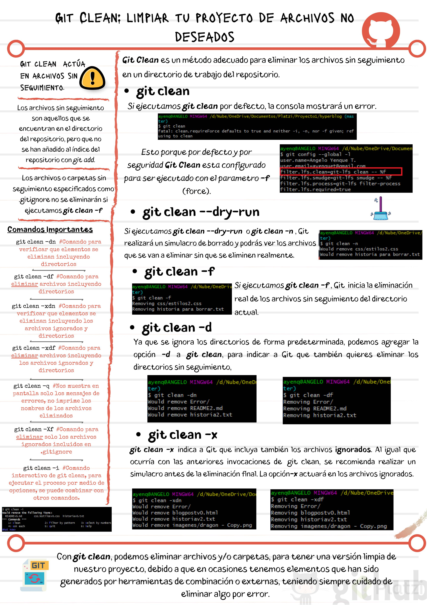

# Git Clean: limpiar tu proyecto de archivos no deseados

Mientras estamos trabajando en un repositorio podemos añadir archivos a él, que realmente no forma parte de nuestro directorio de trabajo, archivos que no se deberían de agregar al repositorio remoto.

El comando ```clean``` actúa en archivos sin seguimiento, este tipo de archivos son aquellos que se encuentran en el directorio de trabajo, pero que aún no se han añadido al índice de seguimiento de repositorio con el comando ```add```.

```
$ git clean
```

La ejecución del comando predeterminado puede producir un error. La configuración global de Git obliga a usar la opción ```force``` con el comando para que sea efectivo. Se trata de un importante mecanismo de seguridad ya que este comando no se puede deshacer.

## Revisar que archivos no tienen seguimiento

```
$ git clean --dry-run
```

## Eliminar los archivos listados de no seguimiento

```
$ git clean -f
```

Git clean tiene muchísimas opciones adicionales, que puedes explorar al ver su[documentación oficial](https://git-scm.com/docs/git-clean).

### Notas

