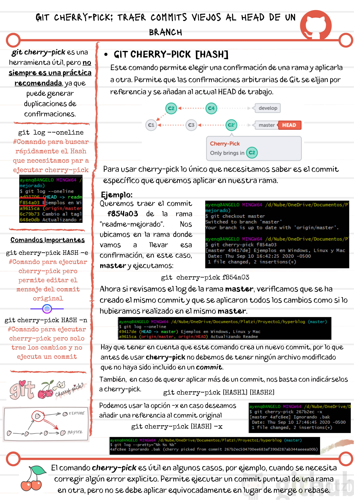

# Git cherry-pick: traer commits viejos al head de un branch

**Git Cherry-pick** es un comando que permite tomar uno o varios commits de otra rama sin tener que hacer un merge completo. Así, gracias a cherry-pick, podríamos aplicar los commits relacionados con nuestra funcionalidad en la rama master sin necesidad de hacer un merge.

Para demostrar cómo utilizar git cherry-pick, supongamos que tenemos un repositorio con el siguiente estado de rama:

```
a -b - c - d   Master
         \
           e - f - g Feature
```

El uso de git cherry-pick es sencillo y se puede ejecutar de la siguiente manera:

```
git checkout master
```

En este ejemplo, commitSha es una referencia de confirmación. Puedes encontrar una referencia de confirmación utilizando el comando git log. En este caso, imaginemos que queremos utilizar la confirmación ‘f’ en la rama master. Para ello, primero debemos asegurarnos de que estamos trabajando con esa rama master.

```
git cherry-pick f
```

Una vez ejecutado, el historial de Git se verá así:

```
a -b - c - d - f   Master
         \
           e - f - g Feature
```

La confirmación f se ha sido introducido con éxito en la rama de funcionalidad

### Atención

Cherry-pick **es una mala práctica** porque significa que estamos reconstruyendo la historia, **usa cherry-pick con sabiduría**. Si no sabes lo que estás haciendo, mejor evita emplear este comando.

### Notas

