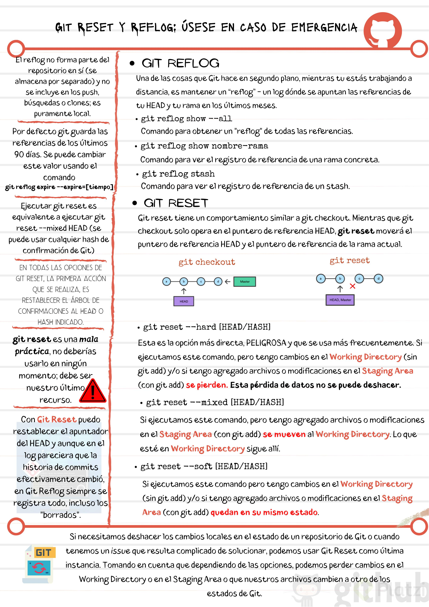

# Git Reset y Reflog: úsese en caso de emergencia

Git guarda todos los cambios aunque decidas borrarlos, al borrar un cambio lo que estás haciendo sólo es actualizar la punta del branch, para gestionar éstas puntas existe un mecanismo llamado registros de referencia o ```reflogs```… La gestión de estos cambios es mediante los hash’es de referencia (o ```ref```) que son apuntadores a los commits… Los recoges registran cuándo se actualizaron las referencias de Git en el repositorio local (sólo en el local), por lo que si deseas ver cómo has modificado la historia puedes utilizar el comando:

```
git reflog
```

Muchos comandos de Git aceptan un parámetro para especificar una referencia o "ref", que es un puntero a una confirmación sobre todo los comandos:

- ```git checkout``` Puedes moverte sin realizar ningún cambio al commit exacto de la ```ref```

```
git checkout eff544f
```

- ```git reset```: Hará que el último commit sea el pasado por la ```ref```, usar este comando sólo si sabes exactamente qué estás haciendo

```
git reset --hard eff544f # Perderá todo lo que se encuentra en staging y en el Working directory y se moverá el head al commit eff544f
git reset --soft eff544f # Te recuperará todos los cambios que tengas diferentes al commit eff544f, los agregará al staging area y moverá el head al commit eff544f
```

- ```git merge```: Puedes hacer merge de un commit en específico, funciona igual que con una branch, pero te hace el merge del estado específico del commit mandado

```
git checkout master
git merge eff544f # Fusionará en un nuevo commit la historia de master con el momento específico en el que vive
```

¿Qué pasa cuando todo se rompe y no sabemos qué está pasando? Con ```git reset HashDelHEAD``` nos devolveremos al estado en que el proyecto funcionaba.

- ```git reset --soft HashDelHEAD``` te mantiene lo que tengas en staging ahí.
- ```git reset --hard HashDelHEAD``` resetea absolutamente todo incluyendo lo que tengas en staging.

### Atención

```git reset``` es una mala práctica, **no deberías usarlo en ningún momento**. Debe ser nuestro último recurso.

### Notas

