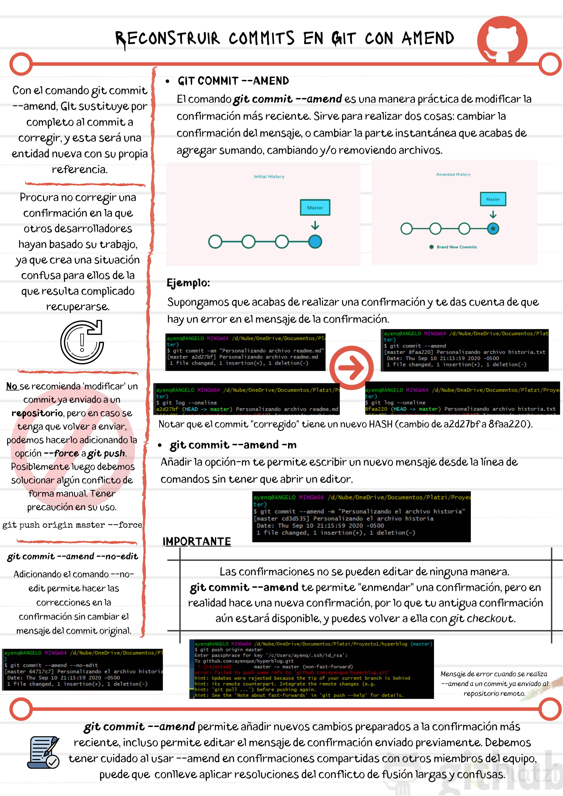

# Reconstruir commits en Git con amend

*Remendar* un commit con ```amend``` puede modificar el commit más reciente (enmendar) en la misma rama. Lo ejecutamos así:

```
git add -A # Para hacer uso de amend los archivos deben de estar en staging
git commit --amend # Remendar último commit
```

Este comando sirve para agregar archivos nuevos o actualizar el commit anterior y no generar commits innecesarios. También es una forma sencilla de **editar o agregar comentarios al commit anterior** porque abrirá la consola para editar este commit anterior.

### Atención

Usar ```amend``` es una **mala práctica**, sobre todo cuando ya se ha hecho push o pull al repositorio remoto. Al momento de hacer ```amend``` con algún commit que esté en remoto, va a generar un conflicto que se va a arreglar haciendo un ```commit adicional``` y se **perderá el beneficio** del amend.

### Notas

