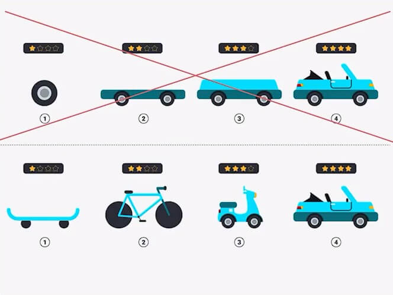

# Cuándo usar React.js

Para saber cuándo usar React es necesario **conocer el tipo de proyecto** que estás desarrollando. Conociendo los alcances actuales y los futuros, podrás tener un panorama completo de las necesidades que vas a cubrir y cuáles son las funciones básicas que debe tener para ser un **MVP**.

React es muy útil cuando queremos construir **rápidamente** la primera versión funcional de una aplicación web sin sacrificar su **escalabilidad**. Si no necesitamos escalarla después, no es necesario utilizar React, podemos utilizar JavaScript vanilla.

## ¿Qué es un MVP?

**MVP (Minimum Viable Product - Producto Mínimo Viable):** se refiere a construir funcionalidades pequeñas que sean completas para que podamos lanzarla y medir su impacto y decidir si seguir ese camino o probar otra cosa.

Hay que escoger el problema más crucial que debe resolver la aplicación.

## Flujos de trabajo para aplicaciones web

Existen dos flujos de trabajo para crear aplicaciones web profesionalmente.

### 1. Modelo en cascada

Cada equipo tiene un tiempo para hacer todo su respectivo trabajo para construir una aplicación.

Por ejemplo: el equipo de diseño diseña la aplicación, el de desarrollo programa todo lo diseñado y finalmente se lanza la app recogiendo el feedback de los usuarios y se vuelve a empezar tomando en cuenta lo dicho por los usuarios.

Es problemático porque el esfuerzo puede ser en vano porque no se tiene un feedback hasta que se termina de construir la app.

### 2. Modelo del ciclo MVP iterativo

El modelo del ciclo MVP se refiere a que cada equipo se enfocará en ciclos pequeños para construir partes más pequeñas de una app que en conjunto se puedan ir ensamblando para hacer la app completa.

Resuelve el problema del modelo anterior, aquí se recibe el feedback al terminar cada pequeño ciclo, recibiendo así el feedback de manera más inmediata que antes.

## Análisis: componentes y comportamientos

**Componentes:** son la forma de estructurar las piezas de nuestra página web para hacerlas escalables, nos ahorran tiempo y esfuerzo. Son abstracciones de los elementos de nuestra página web para ser reusados las veces que necesitemos.

Los componentes pueden trabajar de manera independiente a los demás, pero con React todos los componentes tienen una conexión con el resto de componentes, para que en conjunto puedan reaccionar al comportamiento de los usuarios.

**Comportamiento:** cómo actúan nuestros componentes con las interacciones de los usuarios.

## Lecturas recomendadas

- [Curso de Manipulación del DOM - Platzi](https://platzi.com/cursos/dom/)
- [Curso de Frameworks y Librerías de JavaScript - Platzi](https://platzi.com/cursos/frameworks-javascript/)