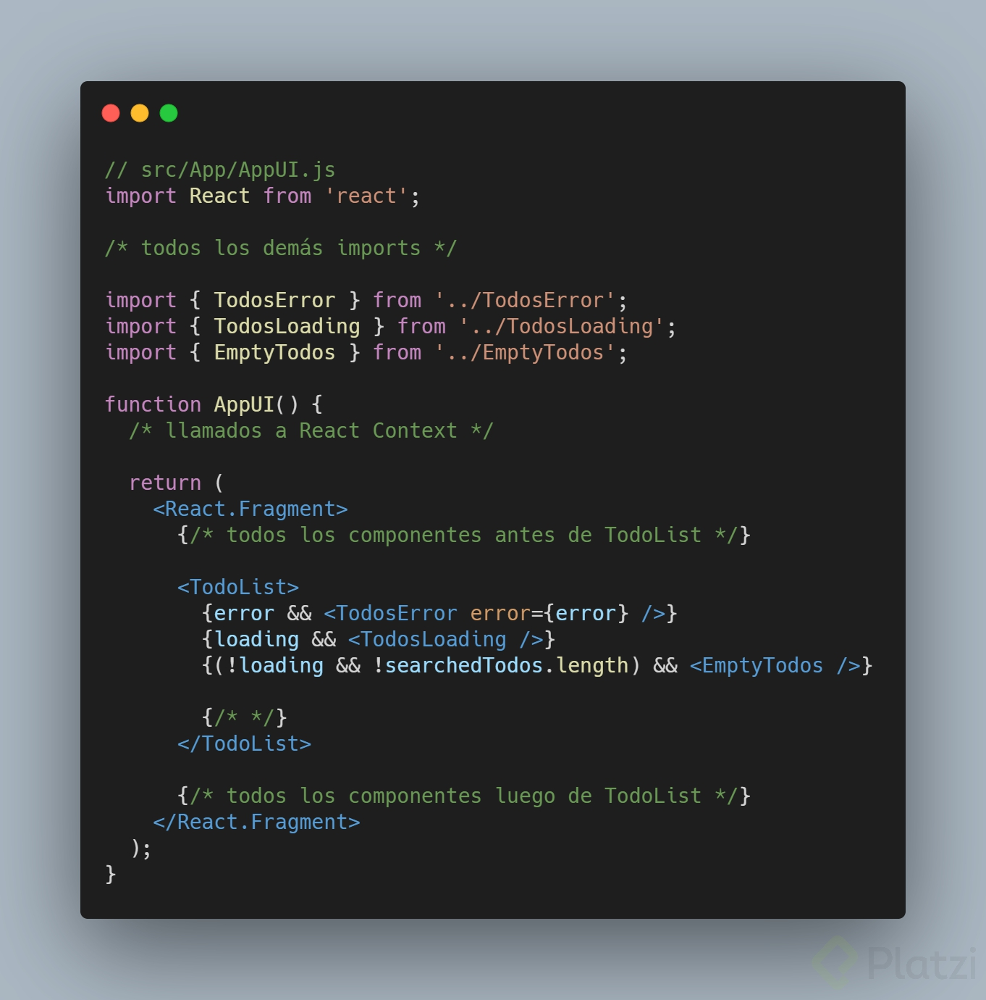
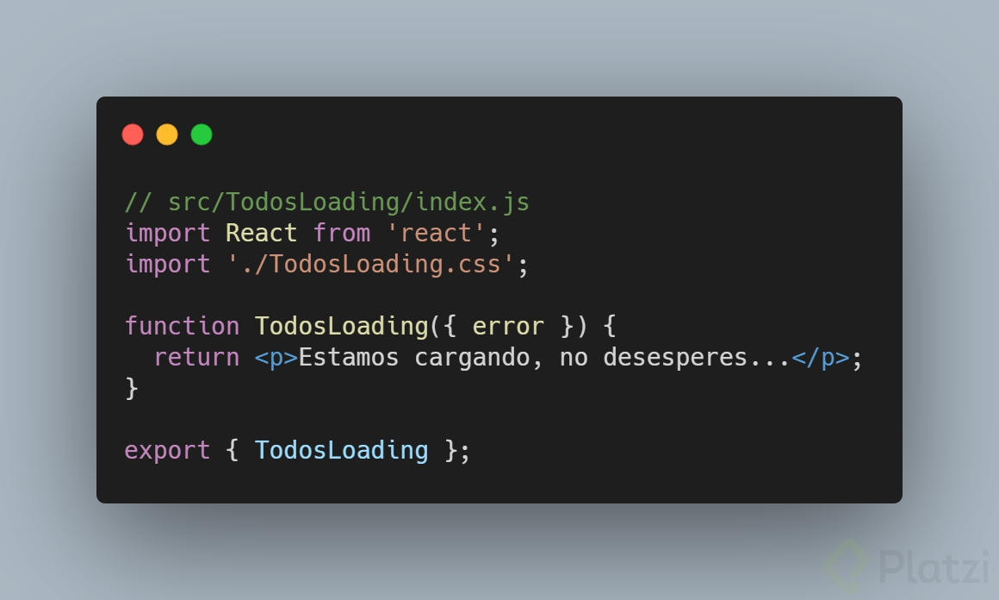
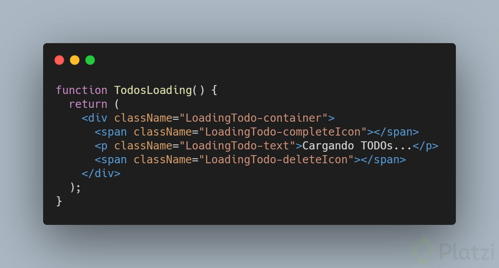
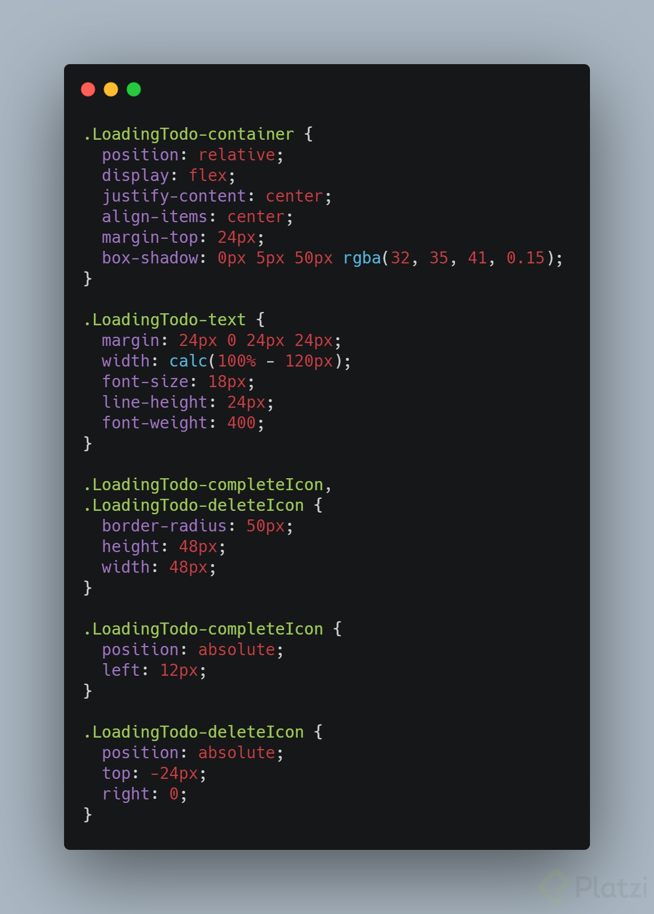
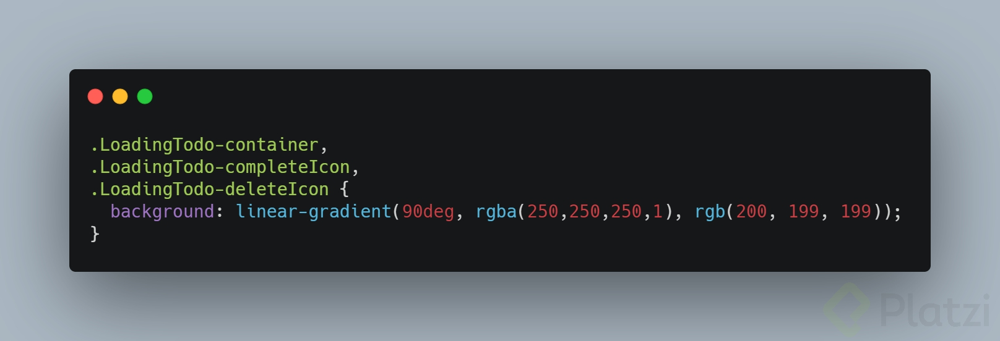
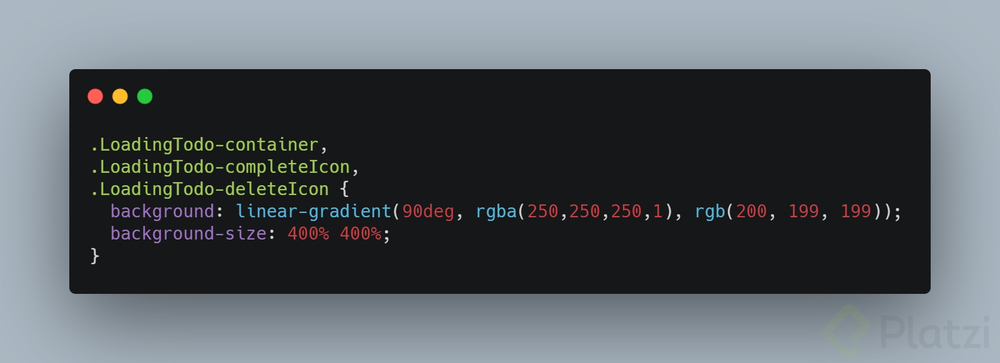
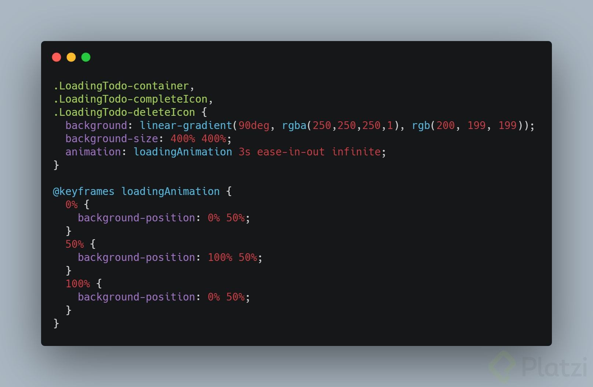

# Reto: loading skeletons

Muchas aplicaciones se quedan en blanco mientras cargan su contenido. Otras muestran algún mensaje de "cargando" y luego sí renderizan todo el contenido de la aplicación.

Pero para ofrecerle una mejor experiencia a nuestros usuarios (UX) es mejor renderizar todo el contenido posible, incluso si no ha terminado de cargar alguna parte de la aplicación. En TODO Machine, por ejemplo, podemos mostrar varios componentes desde el principio aunque no hayamos terminado de cargar la lista de TODOs.

Pero un párrafo que diga “cargando” definitivamente NO es la mejor forma de comunicarle a los usuarios que estamos cargando (el mensaje es claro, pero podríamos buscar una solución más… estética).

Existen muchas posibles soluciones, desde animaciones sencillas (como 3 puntitos intercalando diferentes niveles de opacidad) hasta [loading skeletons (esqueletos de carga)](https://platzi.com/blog/tutorial-como-crear-una-animacion-de-carga-de-contenido-tipo-facebook/). Incluso existen herramientas interactivas como [Create React Content Loader](https://skeletonreact.com/) para agilizar estos desarrollos.

El reto de esta clase es que maquetes cualquiera de estas soluciones y nos la muestres en la sección de comentarios. En esta lectura te mostraré mi solución, pero te recomiendo que no la veas hasta intentar tu propia solución.

💡 Te recomiendo esta lectura: [5 estados clave para crear interfaces coherentes](https://platzi.com/blog/ui-stack/)

## Tu propio loading skeleton en React

Lo primero que vamos a hacer es crear 3 nuevos componentes para trabajarlos independientemente: **TodosError, TodosLoading y EmptyTodos**.

Ya que tenemos estos 3 componentes, ahora vamos a llamarlos desde el componente AppUI para conectarlos con la aplicación.

¡Muy bien! Ahora sí podemos concentrarnos mucho mejor para trabajar el estado de carga de TODOS dentro del componente **TodosLoading**.

Para empezar, voy a crear y conectar un archivo **TodosLoading.css** para definir los estilos de mi esqueleto:

Llegó el momento más importante: maquetar.

Debemos definir qué elementos necesitamos para el esqueleto y luego les daremos estilos con CSS. Como la idea es replicar la estructura de un TODO, vamos a necesitar una cajita para el contenedor del TODO, una cajita para el ícono de completar, otra cajita para el ícono de borrar y una última cajita para el texto.

💡 Le digo a cada elemento “cajita” porque el objetivo de los esqueletos de carga no es replicar todos estos elementos, sino que cada uno será un elemento “fantasma”. Deben ser lo suficientemente parecidos a los TODOs reales para que los usuarios entiendan que estos elementos están relacionados con los TODOs, pero lo suficientemente abstractos y grisáceos para que se entienda que aún los estamos cargando.

¡Y ahora debemos crear los estilos!

Primero vamos a definir los tamaños y posiciones de cada elemento (tal cual copiando y pegando los estilos del TodoItem.css, pero cambiando los nombres de las clases y descartando las propiedades innecesarias):

Ahora vamos a todas las cajitas (menos la del texto) para darles un color de fondo con gradiente:

Luego le configuraremos un tamaño de fondo lo suficientemente grande como para que pueda darla vuelta sin dejar espacios vacíos (400% es más que suficiente):

Y finalmente le daremos una animación que cambie la posición del fondo al principio, a la mitad y al final (te recomiendo darle al menos 3 segundos de duración para que tu animación no se vea atropellada, sino por el contrario con un efecto suave e hipnotizante):

💡 Puedes ir a *useLocalStorage.js* y cambiar el tiempo que tardamos en llamar a nuestro efecto con la función setTimeout para poder visualizar tu esqueleto de carga correctamente.

Recuerda que puedes tomar esta trilogía de cursos para aprender muchísimo más sobre transformaciones, transiciones y animaciones con CSS:

- [Curso de Transformaciones y Transiciones en CSS](https://platzi.com/cursos/transformaciones-transiciones-css/)
- [Curso de Animaciones con CSS](https://platzi.com/cursos/animaciones-css/)
- [Curso Práctico de Maquetación y Animaciones con CSS](https://platzi.com/cursos/animaciones-css-practico/)