# Reto: icon component

Por ahora los íconos de nuestra aplicación solo son etiquetas span con algún carácter representando la acción que conseguirán los usuarios al presionarlos. No está mal, funciona. Pero queremos reutilizar estos íconos fuera del componente TodoItem.

Por eso el reto de esta clase es que crees tu propio componente TodoIcon, las reglas son:

Te debe permitir elegir qué tipo de ícono quieres (marcar como completado, borrar o incluso algunos más que podamos necesitar).

Cada ícono también debe poder tener estados (cambios al color o alguna otra propiedad del ícono para darle feedback a los usuarios de que realizaron alguna acción, como dar click o pasar el mouse por encima).

Es válido que uses varios componentes en vez de solo uno para definir la lógica de tus íconos.

Haz tu mayor esfuerzo por completar el reto y publicar tu solución en los comentarios. Luego de eso puedes ver mi propuesta de solución.

## Solución:

La ventaja de usar letras para simular el comportamiento de nuestros íconos es que podemos cambiarles el color con CSS extremadamente fácil. La desventaja es que no son muy “estéticas”.

La ventaja de usar imágenes es que podemos tener la versión más estética de cada ícono. La desventaja es que no podemos cambiarles el color con CSS, necesitamos a fuerzas otra imagen con el nuevo color.

Afortunadamente, tenemos una tercera alternativa con las ventajas de ambos mundos: svg.

Las imágenes en SVG son diseñadas por la persona encargada del diseño, pero al exportarlas en formato SVG tenemos la imagen “maquetada” con etiquetas HTML que podemos modificar con CSS.

Su única desventaja es la complejidad de su implementación. Pero somos hijas e hijos de Platzi, no vinimos para lo fácil, sino para nunca parar de aprender. ¡Así que a la carga!

Empecemos creando un componente TodoIcon en su propia carpeta y con sus respectivos archivos de JavaScript y CSS:

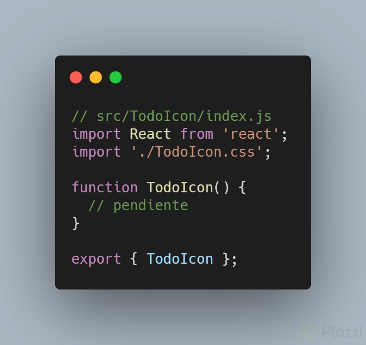

Ahora debemos pensar qué propiedades pueden necesitar nuestros íconos, yo elegí las siguientes:

*type:* para seleccionar qué ícono svg vamos a mostrar.
*color:* para seleccionar el color de nuestro ícono *svg*, por defecto será *gray*.
*onClick:* para invocar alguna función cuando le demos click al contenedor de nuestro ícono.

Recuerda que los usuarios no siempre dan click o presionan la pantalla de sus celulares con completa precisión, por lo que es muy buena idea crear un contenedor invisible alrededor de nuestros íconos.

💡 Material Design tiene una excelente [guía sobre diseño de íconos](https://material.io/design/iconography/system-icons.html), te recomiendo estudiarla para descubrir más detalles interesantes.

Yo decidí utilizar una etiqueta span para el contenedor de los íconos. Así que este span recibirá la propiedad onClick, mientras que el SVG (que ya en un momento vamos a crear) recibirá las otras dos propiedades.

También utilizaré la prop *type* para darle clases personalizadas a cada contenedor de mis íconos.

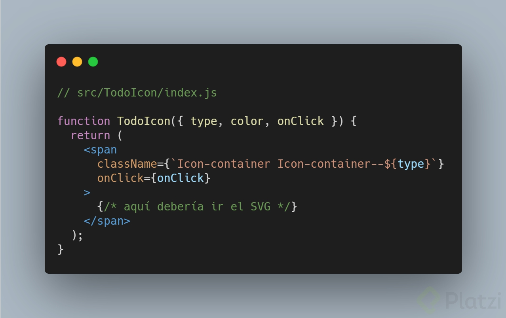

¡Contenedor listo!

Ahora debemos encargarnos de los SVG. Está perfecto si quieres hacerlos a mano con herramientas como Figma o Illustrator.

En mi caso simplemente usaré alguna herramienta de íconos como [Flaticon](https://www.flaticon.com/) y descargaré los íconos que vea conveniente en la misma carpeta TodoIcon. De esta forma podremos importarlos como componentes de React gracias a la configuración por defecto que nos ofrece Create React App.

Te recomiendo importar tus íconos SVG desde tus componentes en React de esta forma:

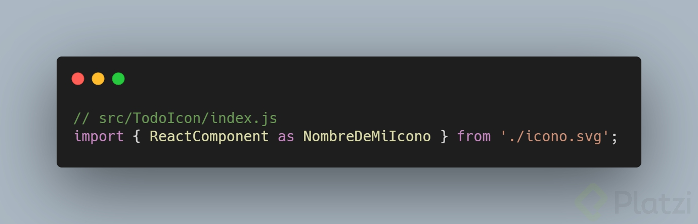

Que luego podremos llamar así:

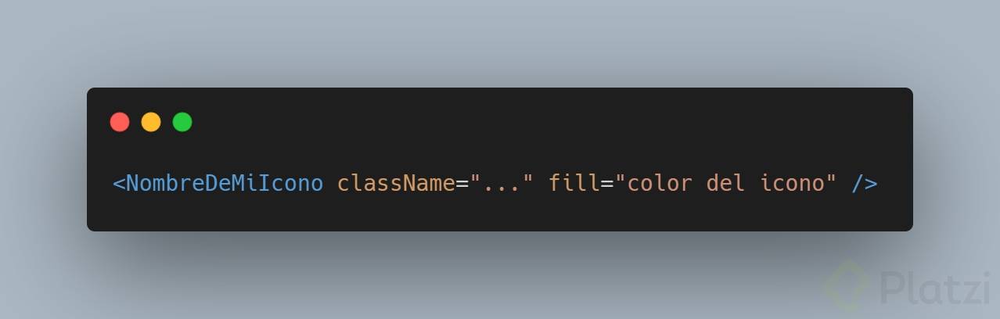

Yo usaré dos íconos (uno de hecho y otro de delete):

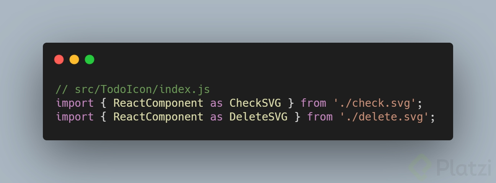

Lo que nos falta es determinar cuál SVG mostrar dependiendo de la propiedad type que nos envíe el componente que llame a nuestro TodoIcon.

Hay muchas formas de lograr esto, mi forma favorita es crear un objeto con todos los íconos que nuestro componente puede mostrar:

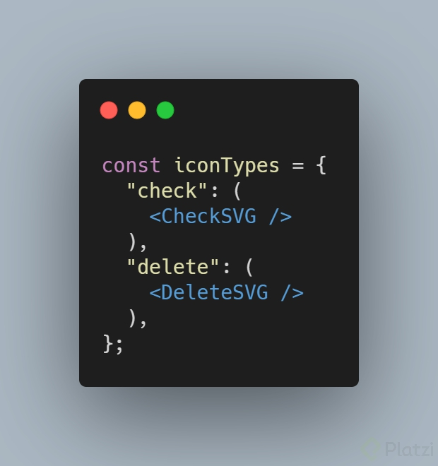

Y luego dentro de nuestro componente TodoIconllamamos al SVG que esté dentro de la propiedad con el mismo nombre que recibamos en la prop *type*:

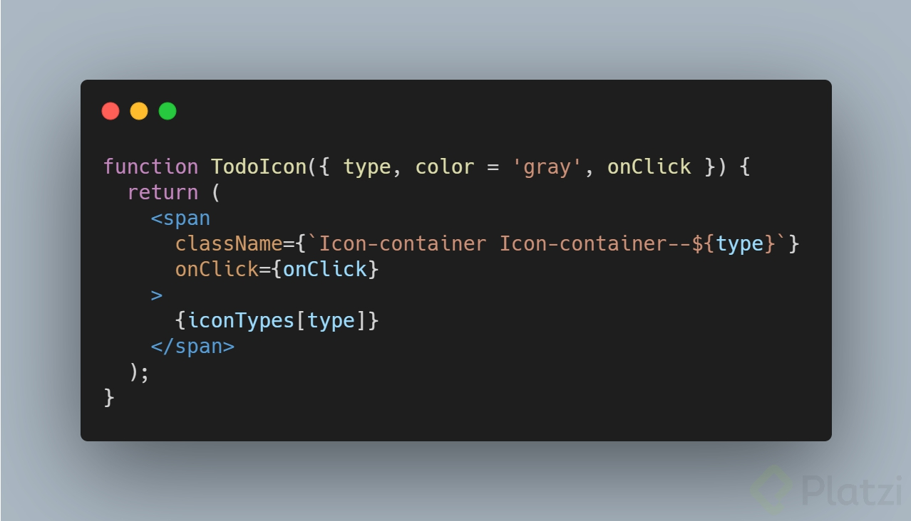

Así automáticamente mostraremos el icono CheckSVG cuando la prop *type* tenga el valor *check* o el icono DeleteSVG cuando tenga el valor *delete*.

Aunque hay un superpoder más que podemos usar. Si envolvemos nuestros íconos dentro de funciones vamos a poder enviarles propiedades que cambien su presentación o comportamiento.

En este caso voy a usar esta funcionalidad para enviarle la prop color a nuestros SVG (y así cambiarles su color cuando los componentes que llamen a nuestros íconos así lo requieran).

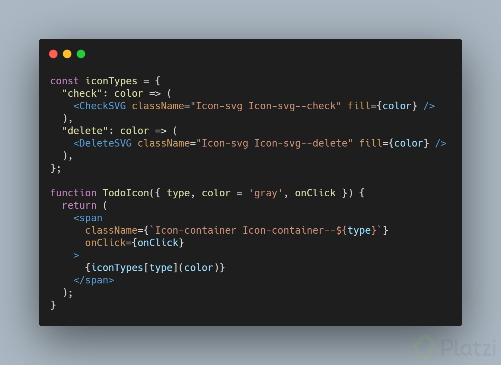

El último paso para que nuestros componentes funcionen sería agregar nuestro código CSS al nuevo archivo de estilos TodoIcon.css (y de paso borrar el código que ya no necesitamos en TodoItem.css):

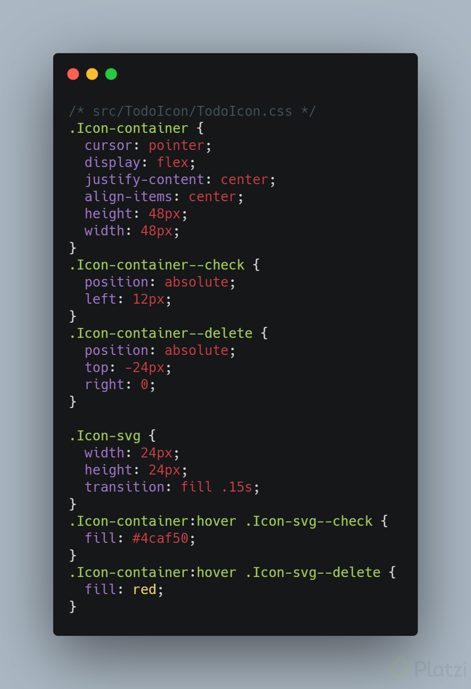

¡Excelente! Nuestro componente TodoIcon ya funciona y podemos llamarlo desde el componente TodoItem para darle sus íconos mucho mejor configurados.

Aunque antes quiero hacer un poco más de composición.

Cada vez que llamamos a nuestro ícono debemos enviar varias props. Pero ¿qué tal si crearamos un componente que envíe todas esas props por nosotros?

Lo que voy a hacer es crear dos nuevos componentes, CompleteIcon y DeleteIcon. Cada uno llamará al componente TodoIcon con sus respectivas props necesarias. Y luego podremos llamar mucho más fácil a estos dos nuevos componentes donde los necesitemos.

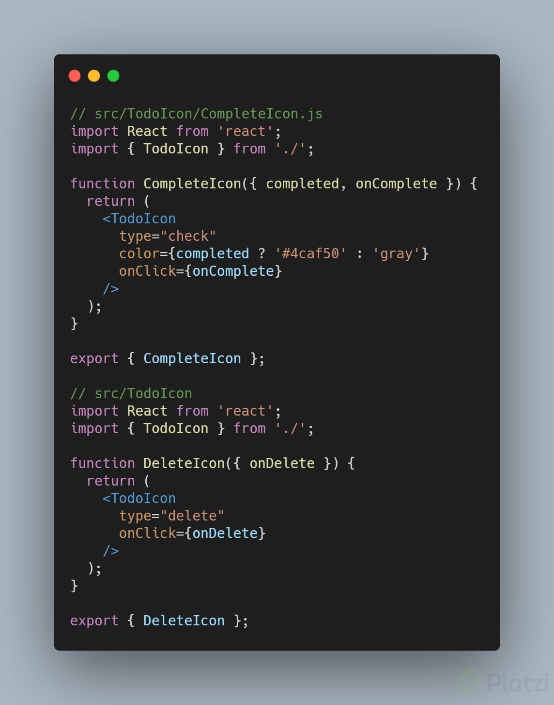

Y estos componentes ahora sí los llamaremos desde TodoItem:

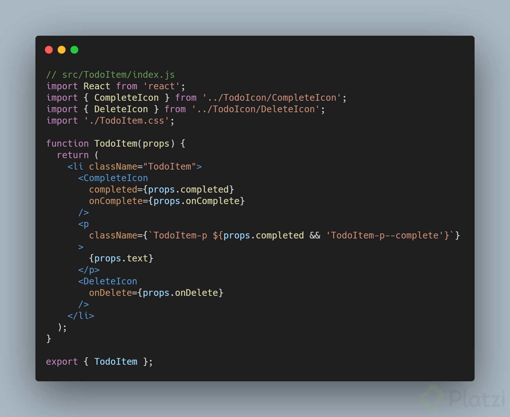

Así seguiría construyendo mi componente TodoIcon con todos los íconos que vaya requiriendo nuestra aplicación TODO Machine.

¡Te espero en la siguiente clase para desplegar nuestra aplicación a GitHub Pages!

