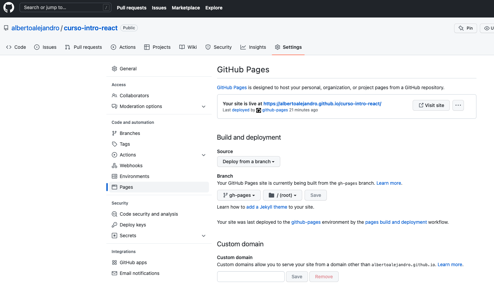

# Deploy con GitHub Pages

Existen varias maneras para hacer deploy de nuestras aplicaciones, una de las más populares es **GitHub Pages**.

GitHub Pages es un servicio de GitHub que nos permite **alojar nuestros proyectos** y mostrarlos en vivo en una página web estática sin necesidad de pagar por hosting o tener conocimientos en servidores, aunque tiene algunas limitantes.

Para inicializar nuestro proyecto con **Create React App**, utilizamos el comando ```npm start```, lo que hace este comando, es que iniciar un servidor de *node.js* para poder compilar nuestro código de React a JavaScript, también para poder estar al pendiente por cambios y refrescar automáticamente nuestro proyecto al hacer algún cambio, entre muchas otras cosas.

La principal desventaja de **GitHub Pages**, es que no podemos correr un servidor de *node.js*, solamente soporta archivos estáticos:

- HTML
- CSS
- JavaScript
- Imágenes

Para hacer el deploy de nuestra aplicación, necesitaremos hacer lo siguiente:

1. Instalar la dependencia gh-pages con npm.
2. Modificar un poco el *package.json*.
3. Y utilizaremos otros comandos de Create React App para construir una versión de producción de nuestro proyecto.

## Instalar gh-pages

Para instalar esta dependencia en nuestro proyecto, necesitamos ejecutar este comando en la terminal, dentro de la carpeta root en la que está nuestro proyecto: 

```npm install --save-dev gh-pages``` o ```npm i -D gh-pages``` que es lo mismo.

⚠️ Si aún no tienes tu proyecto en un repositorio de GitHub, es el momento perfecto para subirlo, con todos tus cambios.

## Modificar nuestro package.json

Primero necesitamos agregar la regla "homepage":

```json
"devDependencies": {
    "gh-pages": "^4.0.0"
},
"homepage": "https://github.com/albertoalejandro/curso-intro-react.git"
```

Para que funcione necesitas poner los datos necesarios en la URL.

Y ahora agregamos unos scrips de gh-pages para el deploy, estos scripts prepararán nuestra aplicación para el deploy.

Dentro de npm podemos utilizar los prefijos: *pre* y *post* para decir que ejecute cualquier cosa que queramos antes o después de ejecutar el script que necesitamos.

Nuestro package.json quedaría como el siguiente:

```json
{
  "name": "curso-intro-react",
  "version": "0.1.0",
  "private": true,
  "dependencies": {
    "@testing-library/jest-dom": "^5.16.4",
    "@testing-library/react": "^13.3.0",
    "@testing-library/user-event": "^13.5.0",
    "react": "^18.2.0",
    "react-dom": "^18.2.0",
    "react-scripts": "5.0.1",
    "web-vitals": "^2.1.4"
  },
  "scripts": {
    "start": "react-scripts start",
    "build": "react-scripts build",
    "test": "react-scripts test",
    "eject": "react-scripts eject",
    "predeploy": "npm run build",
    "deploy": "gh-pages -d build"
  },
  "eslintConfig": {
    "extends": [
      "react-app",
      "react-app/jest"
    ]
  },
  "browserslist": {
    "production": [
      ">0.2%",
      "not dead",
      "not op_mini all"
    ],
    "development": [
      "last 1 chrome version",
      "last 1 firefox version",
      "last 1 safari version"
    ]
  },
  "devDependencies": {
    "gh-pages": "^4.0.0"
  },
  "homepage": "https://albertoalejandro.github.io/curso-intro-react"
}
```

## Deploy de nuestra aplicación

Ahora solo necesitamos ejecutar nuestros scripts: ```npm run deploy```.

¡Al hacer esto, si no nos aparece ningún error, quiere decir nuestra página ya está en vivo!

Si te aparece algún error, no dudes en dejar tu pregunta para que podamos ayudarte, también puedes revisar los pasos anteriores o revisar esta [Guía para subir tus proyectos de React con gh-pages](https://platzi.com/tutoriales/1548-react/4065-guia-para-usar-github-pages-en-tus-proyectos-de-reactjs/).

## ¿Cómo puedo ver mi aplicación en la web?

Para poder ver tu aplicación ya en la web puedes entrar a la URL que escribiste en el *homepage* de tu *package.json*,

Otra forma es entrar al repositorio de tu proyecto en **GitHub -> Ajustes**, y en el menú de la izquierda, en **Code and automation** te aparecerá una sección de **Pages**, ahí estará un link para ver tu proyecto.




